# WindowManager 多用户数据聚合方案需求分析

## 一、需求概述

### 1.1 需求背景

OpenHarmony 多用户场景下（如车机系统），系统 SA（System Ability）需要同时管理多个前台用户的窗口数据。典型场景：

**车机多屏多用户场景**：
- 中控屏（userId=100）
- 副驾屏（userId=101）：副驾从副驾屏切换用户（userId=101 → userId=103）
- 后排屏（userId=102）后排娱乐屏的主窗口

**SA 业务需求**：
- AMS SA：需要获取所有前台用户的主窗口列表，进行全局任务管理
- 无障碍 SA：需要监听所有前台用户的焦点变化，提供全局无障碍服务

**核心诉求**：
SA 不需要感知具体 userId，只需使用 `AllUsersWindowManager` 单例类，即可：
1. **聚合查询**：一次调用获取所有前台用户的窗口数据
2. **聚合监听**：一次注册监听所有前台用户的窗口事件
3. **自动跟随**：用户切换后自动生效，无需重新注册
4. **独立恢复**：所在用户空间的sceneboard死亡后，无需重新注册

### 1.2 功能需求

#### 1.2.1 AllUsersWindowManager 聚合查询接口

| 接口 | 功能描述 | 示例 |
|------|---------|------|
| `GetAllMainWindowInfo(infos)` | 获取所有前台用户的主窗口信息 | 返回中控+副驾+后排所有主窗口列表 |
| `GetVisibilityWindowInfo(infos)` | 获取所有前台用户的窗口可见性信息 | 返回所有用户的可见窗口列表 |
| `GetAccessibilityWindowInfo(infos)` | 获取所有前台用户的无障碍窗口信息 | 返回所有用户的无障碍窗口列表 |

#### 1.2.2 AllUsersWindowManager 聚合监听接口

| 接口 | 功能描述 | 示例 |
|------|---------|------|
| `RegisterFocusChangedListener(listener)` | 一次注册监听所有前台用户的焦点变化 | 中控/副驾焦点变化都触发回调 |
| `RegisterVisibilityChangedListener(listener)` | 一次注册监听所有前台用户的窗口可见性变化 | 任一用户窗口可见性变化都触发回调 |
| `RegisterWindowUpdateListener(listener)` | 一次注册监听所有前台用户的窗口更新事件 | 任一用户窗口更新都触发回调 |

#### 1.2.3 动态用户管理

- `GetActiveUserIds()`：获取当前所有前台用户 ID 列表
- 用户切换时自动更新监听范围：前台用户激活时自动注册，前台用户退出时自动注销

### 1.3 问题分析

**当前实现存在的问题**：

| 问题 | 原因 | 影响 |
|------|------|------|
| Agent 覆盖 | 服务端以 `pid + type` 存储 agent，不同 userId 覆盖 | 只有最后一个 userId 收到回调 |
| 回调丢失 | `AllUsersWindowManager` 注册监听时，只有最后一个 userId 的 agent 有效 | 其他用户焦点变化无法监听 |
| 数据不完整 | 查询接口只能查单个 userId 的数据 | 无法聚合所有用户数据 |
| 用户切换失效 | 用户切换后监听范围不更新 | 新用户事件无法监听 |

**根本原因**：
- WindowManager 多实例模式下，每个 userId 创建独立的 agent
- 服务端 `SessionManagerAgentController` 存储结构未考虑 instanceUserId 维度
- `AllUsersWindowManager` 缺乏动态用户管理机制

### 1.4 解决方案

**核心设计**：

1. **服务端三层 Map 存储**：`pid → instanceUserId → type → agent`
   - 保证不同 userId 的 agent 不覆盖
   
2. **客户端独立 Agent**：每个 WindowManager(userId) 创建独立 agent
   - agent.userId_ = 实例 userId
   
3. **AllUsersWindowManager 聚合机制**：
   - 遍历 activeUserIds，向各 WindowManager(userId) 注册
   - 用户激活时自动注册全局监听器
   - 用户退出时自动注销全局监听器

### 1.5 需求范围

| 范围 | 模块 | 改动类型 | 说明 |
|------|------|---------|------|
| 服务端 | SessionManagerAgentController | 存储结构扩展 | 三层 Map，新增 instanceUserId 维度 |
| IPC | Interface/Proxy/Stub | 参数扩展 | Register/Unregister 接口新增 instanceUserId 参数 |
| 客户端 | WindowManager | Agent 实例化 | agent 从 static 改为实例变量 |
| 客户端 | WindowAdapter | userId 传递 | 向服务端传递 userId_ 作为 instanceUserId |
| 客户端 | SessionManager | 单例改造 | 全局方法 + UserContext 模式 |
| 新增 | AllUsersWindowManager | 聚合管理类 | 单例，聚合查询和监听 |

---

## 二、SA 使用 WindowManager 范式

### 2.1 获取 WindowManager 实例

SA（System Ability）使用 WindowManager 时，根据场景选择不同的实例获取方式：

```cpp
// 方式一：单实例模式（默认，适用于单用户场景）
WindowManager::GetInstance().RegisterFocusChangedListener(listener);  // userId = INVALID_USER_ID

// 方式二：多实例模式（适用于多用户场景）
WindowManager::GetInstance(100).RegisterFocusChangedListener(listener);  // userId = 100
WindowManager::GetInstance(101).RegisterFocusChangedListener(listener);  // userId = 101

// 方式三：全用户聚合模式（适用于需要聚合所有用户数据的场景）
AllUsersWindowManager::GetInstance().RegisterFocusChangedListener(listener);
```

**多实例模式启用条件**：
- 需配置 `window_manager_enable_multi_instance = true`
- 最大实例数限制：`MAX_INSTANCE_NUM = 20`
- 通过 `WindowManager::IsMultiInstanceEnabled()` 判断是否启用

### 2.2 SA 使用范式示例

#### 2.2.1 单用户场景：监听焦点变化

```cpp
// 示例：AccessibilityService 监听焦点变化
class MyFocusListener : public IFocusChangedListener {
public:
    void OnFocused(const sptr<FocusChangeInfo>& focusChangeInfo) override {
        TLOGI(WmsLogTag::DEFAULT, "Window focused: %{public}d", focusChangeInfo->windowId_);
    }
    void OnUnfocused(const sptr<FocusChangeInfo>& focusChangeInfo) override {
        TLOGI(WmsLogTag::DEFAULT, "Window unfocused: %{public}d", focusChangeInfo->windowId_);
    }
};

// 注册
sptr<MyFocusListener> listener = sptr<MyFocusListener>::MakeSptr();
WMError ret = WindowManager::GetInstance().RegisterFocusChangedListener(listener);

// 注销
WMError ret = WindowManager::GetInstance().UnregisterFocusChangedListener(listener);
```

#### 2.2.2 多用户场景：监听所有用户焦点变化

```cpp
// 示例：AllUsersAccessibilityService 监听所有用户焦点变化
class MyGlobalFocusListener : public IFocusChangedListener {
public:
    void OnFocused(const sptr<FocusChangeInfo>& focusChangeInfo) override {
        TLOGI(WmsLogTag::WMS_MULTI_USER, 
            "User %{public}d window focused: %{public}d", 
            focusChangeInfo->uid_ / BASE_USER_RANGE,  // 计算 userId
            focusChangeInfo->windowId_);
    }
    void OnUnfocused(const sptr<FocusChangeInfo>& focusChangeInfo) override {
        // 处理失焦
    }
};

// 使用 AllUsersWindowManager 注册（自动聚合所有活跃用户）
sptr<MyGlobalFocusListener> listener = sptr<MyGlobalFocusListener>::MakeSptr();
WMError ret = AllUsersWindowManager::GetInstance().RegisterFocusChangedListener(listener);

// 获取所有活跃用户 ID
auto activeUserIds = AllUsersWindowManager::GetInstance().GetActiveUserIds();
TLOGI(WmsLogTag::WMS_MULTI_USER, "Active users: %{public}zu", activeUserIds.size());
```

#### 2.2.3 多用户场景：聚合查询窗口信息

```cpp
// 示例：任务管理服务获取所有用户可见窗口信息
std::vector<sptr<WindowVisibilityInfo>> allVisibilityInfos;
WMError ret = AllUsersWindowManager::GetInstance().GetVisibilityWindowInfo(allVisibilityInfos);
if (ret == WMError::WM_OK) {
    for (const auto& info : allVisibilityInfos) {
        TLOGI(WmsLogTag::WMS_MULTI_USER,
            "Window %{public}d, visibility %{public}d, userId %{public}d",
            info->windowId_, info->visibility_, info->uid_ / BASE_USER_RANGE);
    }
}
```

#### 2.2.4 指定用户场景：操作特定用户窗口

```cpp
// 示例：用户切换服务操作指定用户窗口
int32_t targetUserId = 100;

// 获取指定用户的焦点窗口信息
FocusChangeInfo focusInfo;
WindowManager::GetInstance(targetUserId).GetFocusWindowInfo(focusInfo);

// 获取指定用户的可见窗口信息
std::vector<sptr<WindowVisibilityInfo>> visibilityInfos;
WindowManager::GetInstance(targetUserId).GetVisibilityWindowInfo(visibilityInfos);

// 设置指定用户的窗口布局模式
WMError ret = WindowManager::GetInstance(targetUserId).SetWindowLayoutMode(WindowLayoutMode::BASE);
```

### 2.3 AllUsersWindowManager 接口规格

| 接口名 | 功能说明 | 适用场景 |
|--------|---------|---------|
| `GetActiveUserIds()` | 获取所有活跃用户 ID | 多用户场景初始化 |
| `GetVisibilityWindowInfo(infos)` | 聚合所有用户可见窗口信息 | 任务管理、安全审计 |
| `GetAccessibilityWindowInfo(infos)` | 聚合所有用户无障碍窗口信息 | 无障碍服务 |
| `GetAllMainWindowInfo(infos)` | 聚合所有用户主窗口信息 | 任务管理 |
| `RegisterFocusChangedListener(listener)` | 注册全局焦点监听（自动聚合） | 全局焦点监控 |
| `UnregisterFocusChangedListener(listener)` | 注销全局焦点监听 | 监听清理 |
| `RegisterVisibilityChangedListener(listener)` | 注册全局可见性监听（自动聚合） | 全局可见性监控 |
| `UnregisterVisibilityChangedListener(listener)` | 注销全局可见性监听 | 监听清理 |
| `RegisterWindowUpdateListener(listener)` | 注册全局窗口更新监听（自动聚合） | 全局窗口状态监控 |
| `UnregisterWindowUpdateListener(listener)` | 注销全局窗口更新监听 | 监听清理 |

**AllUsersWindowManager 使用注意事项**：
- 单例模式，全局唯一实例
- 自动监听用户增减事件（通过 SessionManager）
- 单实例模式下自动降级为 `WindowManager::GetInstance()` 调用
- 新用户激活时自动向已注册的全局监听器注册

### 2.4 AllUsersWindowManager 活动图

#### 2.4.1 SA 调用聚合查询接口活动图

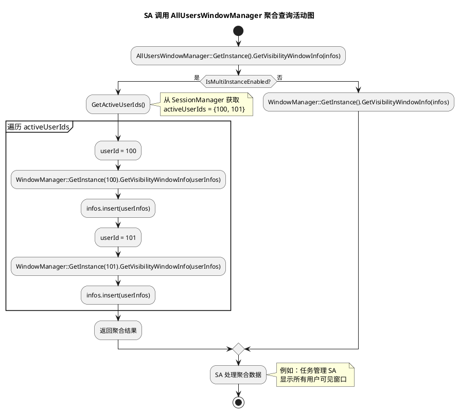

#### 2.4.2 SA 注册聚合监听活动图

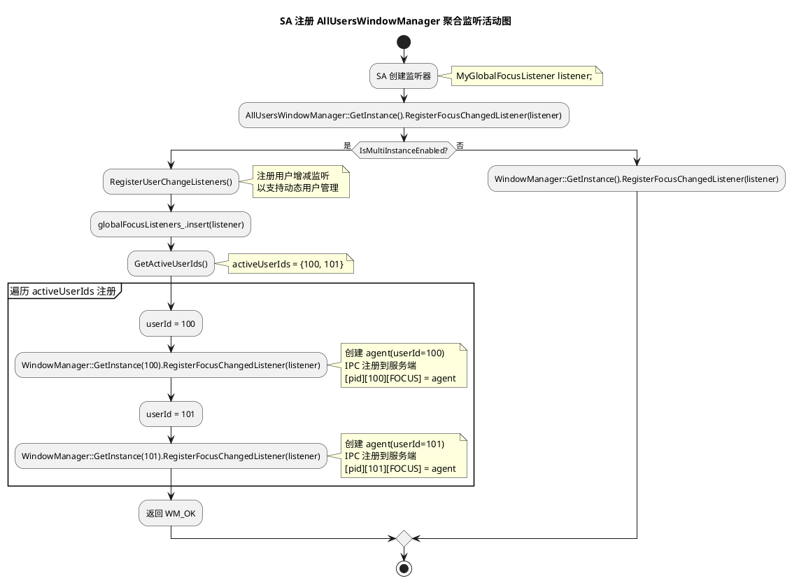

#### 2.4.3 用户切换时动态注册活动图

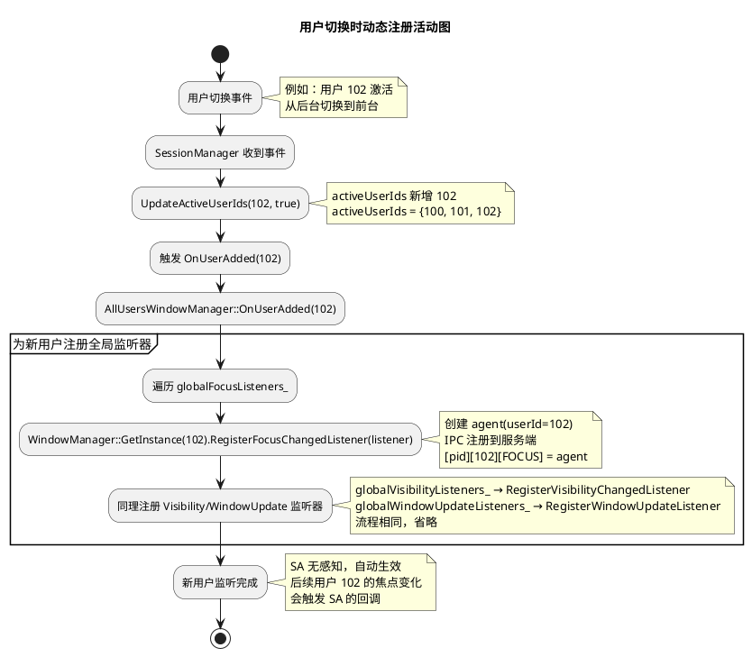

---

## 三、零层设计（系统架构）

### 3.1 进程架构（实际实现：多实例模式）

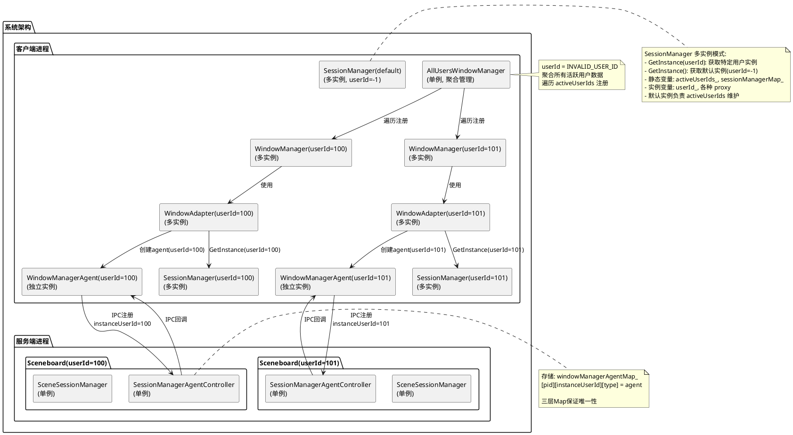

### 3.2 关键进程关系

| 进程类型 | 数量 | userId 关系 | 关键单例/多实例 |
|---------|------|-------------|----------|
| Sceneboard | 每个 userId 一个 | userId 固定 | SceneSessionManager(单例), SessionManagerAgentController(单例) |
| 客户端进程 | 多个 | 可连接多个 userId 的 sceneboard | AllUsersWindowManager(单例), SessionManager(多实例), WindowManager(多实例) |

### 3.3 IPC 数据流

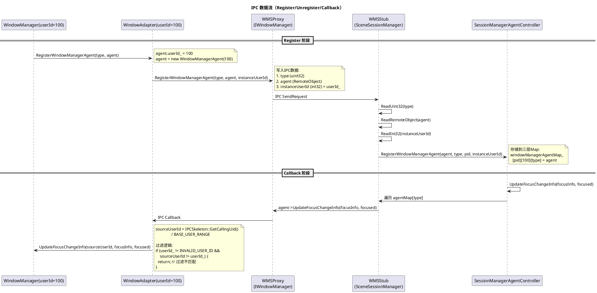

### 3.4 关键设计决策

| 决策项 | 决策内容 | 理由 |
|--------|---------|------|
| Agent 创建方式 | 每个 userId 独立 agent | 避免共享 agent 的状态冲突 |
| 服务端存储结构 | 三层 Map：`pid → instanceUserId → type → agent` | 保证 `pid + instanceUserId + type` 唯一性 |
| instanceUserId 来源 | 客户端 userId_ 成员变量 | IPCSkeleton::GetCallingUid() 返回服务端 UID，不准确 |
| 客户端过滤机制 | `userId_ == sourceUserId || userId_ == INVALID_USER_ID` | 精确匹配，避免误分发 |
| WindowAdapter 多实例 | 按 userId 多实例，内部 userId_ 成员 | 各 userId 独立代理和状态 |
| SessionManager 多实例 | GetInstance(userId) 多实例模式 | 静态变量共享 activeUserIds_，实例变量独立管理 proxy |

---

## 四、一层设计（模块架构）

### 4.1 模块架构图（实际实现：多实例模式）

```plantuml
@startuml OneLayerArchitecture
!define PACKAGE package
!define RECTANGLE class

title 一层设计：模块架构图

PACKAGE "客户端模块" {
    PACKAGE "WindowManager 模块（多实例）" {
        RECTANGLE "WindowManager(userId=100)" as WM100 {
            - userId_: int32_t = 100
            - pImpl_: unique_ptr<Impl>
            + RegisterFocusChangedListener(listener)
            + UnregisterFocusChangedListener(listener)
            + UpdateFocusChangeInfo(sourceUserId, focusInfo, focused)
        }
        
        RECTANGLE "WindowManager(userId=101)" as WM101 {
            - userId_: int32_t = 101
            - pImpl_: unique_ptr<Impl>
            + RegisterFocusChangedListener(listener)
            + UnregisterFocusChangedListener(listener)
            + UpdateFocusChangeInfo(sourceUserId, focusInfo, focused)
        }
        
        RECTANGLE "AllUsersWindowManager" as AUWM {
            {static} - globalFocusListeners_: unordered_set<sptr<IFocusChangedListener>>
            {static} - globalVisibilityListeners_: unordered_set<sptr<IVisibilityChangedListener>>
            {static} - globalListenersMutex_: mutex
            - operationMutex_: mutex
            - userChangeListenersRegistered_: bool
            + static GetInstance(): AllUsersWindowManager&
            + GetActiveUserIds(): unordered_set<int32_t>
            + RegisterFocusChangedListener(listener)
            + UnregisterFocusChangedListener(listener)
            + GetVisibilityWindowInfo(infos)
        }
    }
    
    PACKAGE "SessionManager 模块（多实例）" {
        RECTANGLE "SessionManager(userId=100)" as SM100 {
            - userId_: int32_t = 100
            - sceneSessionManagerProxy_: sptr<ISceneSessionManager>
            - sessionManagerServiceProxy_: sptr<ISessionManagerService>
            - currentWMSUserId_: int32_t
            - isWMSConnected_: bool
            {static} - activeUserIds_: unordered_set<int32_t>
            {static} - sessionManagerMap_: map<int32_t, sptr<SessionManager>>
            + static GetInstance(userId): SessionManager&
            + GetActiveUserIds(userIds): void
            + UpdateActiveUserIds(userId, isConnected): void
            + GetSceneSessionManagerProxy(): sptr<ISceneSessionManager>
            + OnWMSConnectionChanged(wmsUserId, ...): void
        }
        
        RECTANGLE "SessionManager(userId=101)" as SM101 {
            - userId_: int32_t = 101
            - sceneSessionManagerProxy_: sptr<ISceneSessionManager>
            - currentWMSUserId_: int32_t
            - isWMSConnected_: bool
        }
        
        RECTANGLE "SessionManager(default)" as SMDefault {
            - userId_: int32_t = -1
            - userAddedCallbackFunc_: function
            - userRemovedCallbackFunc_: function
        }
    }
    
    PACKAGE "WindowAdapter 模块（多实例）" {
        RECTANGLE "WindowAdapter(userId=100)" as WA100 {
            - userId_: int32_t = 100
            - wmsProxy_: sptr<IWindowManager>
            + RegisterWindowManagerAgent(type, agent)
            + UnregisterWindowManagerAgent(type, agent)
        }
        
        RECTANGLE "WindowAdapter(userId=101)" as WA101 {
            - userId_: int32_t = 101
            - wmsProxy_: sptr<IWindowManager>
            + RegisterWindowManagerAgent(type, agent)
            + UnregisterWindowManagerAgent(type, agent)
        }
    }
    
    PACKAGE "WindowManagerAgent 模块" {
        RECTANGLE "WindowManagerAgent(userId=100)" as WMA100 {
            - userId_: int32_t = 100
            + UpdateFocusChangeInfo(focusInfo, focused)
        }
        
        RECTANGLE "WindowManagerAgent(userId=101)" as WMA101 {
            - userId_: int32_t = 101
            + UpdateFocusChangeInfo(focusInfo, focused)
        }
    }
}

PACKAGE "服务端模块" {
    RECTANGLE "SessionManagerAgentController" as SMAC {
        - windowManagerAgentMap_: map<pid, map<instanceUserId, map<Type, Agent>>>
        - windowManagerAgentPairMap_: map<RemoteObject*, pair<pid, instanceUserId, Type>>
        + RegisterWindowManagerAgent(agent, type, pid, instanceUserId)
        + UnregisterWindowManagerAgent(agent, type, pid, instanceUserId)
        + UpdateFocusChangeInfo(focusInfo, focused)
    }
    
    RECTANGLE "SceneSessionManager" as SSM {
        + RegisterWindowManagerAgent(type, agent, instanceUserId)
        + NotifyFocusChangeInfo(focusInfo, focused)
    }
}

note right of SMAC
  三层Map存储:
  [pid][instanceUserId][type] = agent
  
  pairMap反向索引:
  [agent.AsObject()] = {pid, instanceUserId, type}
end note

WM100 --> WA100 : GetInstance(userId_)
WM101 --> WA101 : GetInstance(userId_)
AUWM --> WM100 : 遍历activeUserIds注册
AUWM --> WM101 : 遍历activeUserIds注册

WA100 --> SM100 : GetInstance(userId_=100)
WA101 --> SM101 : GetInstance(userId_=101)

WA100 --> WMA100 : MakeSptr(userId_=100)
WA101 --> WMA101 : MakeSptr(userId_=101)

WA100 --> SSM : IPC注册(agent, type, instanceUserId=100)
WA101 --> SSM : IPC注册(agent, type, instanceUserId=101)
SSM --> SMAC : RegisterWindowManagerAgent(agent, type, pid, instanceUserId)

@enduml
```

### 4.2 核心类设计

#### 4.2.1 WindowManager 类（多实例）

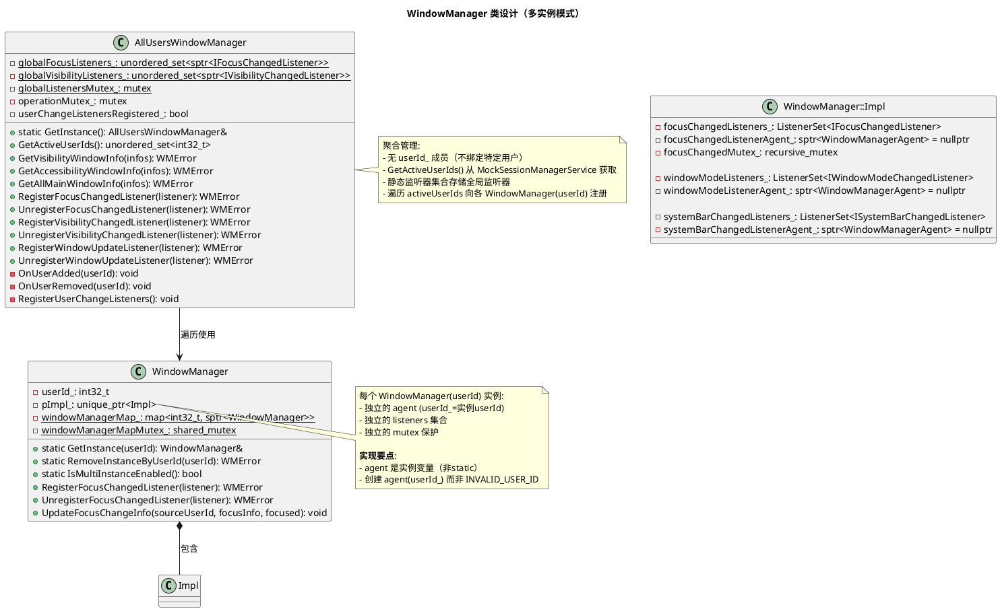

#### 4.2.2 SessionManager 类（多实例模式）

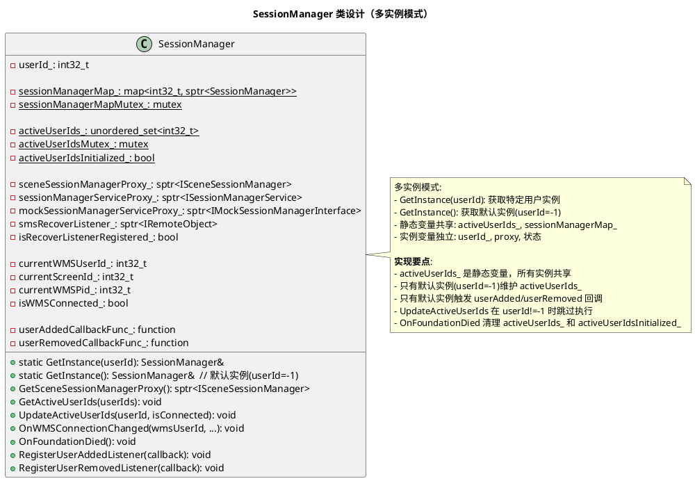

**关键设计说明**：

| 设计点 | 实现方式 |
|--------|----------|
| 实例模式 | 多实例：GetInstance(userId) 和 GetInstance() |
| activeUserIds_ | 静态变量，所有实例共享 |
| sessionManagerMap_ | 静态变量，存储所有实例 |
| 回调触发 | 只有默认实例(userId=-1)触发 userAdded/userRemoved |
| UpdateActiveUserIds | userId!=-1 时跳过，避免多实例重复更新 |
| OnFoundationDied | 清理 activeUserIds_、activeUserIdsInitialized_、smsRecoverListener_ |

#### 4.2.3 SessionManagerAgentController 类（服务端）

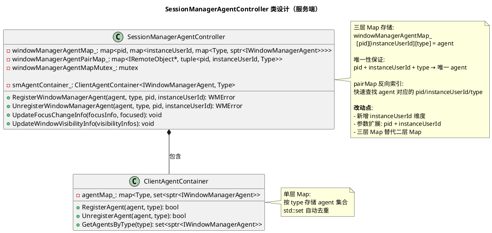

### 4.3 关键流程时序图

#### 4.3.1 RegisterFocusChangedListener 时序图

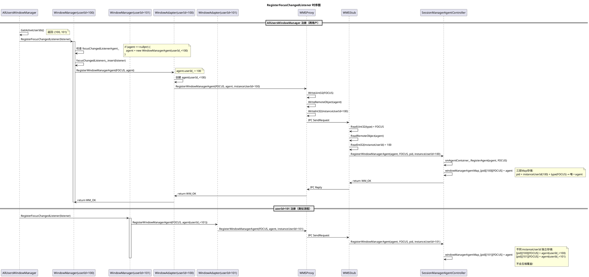

#### 4.3.2 UpdateFocusChangeInfo 回调时序图

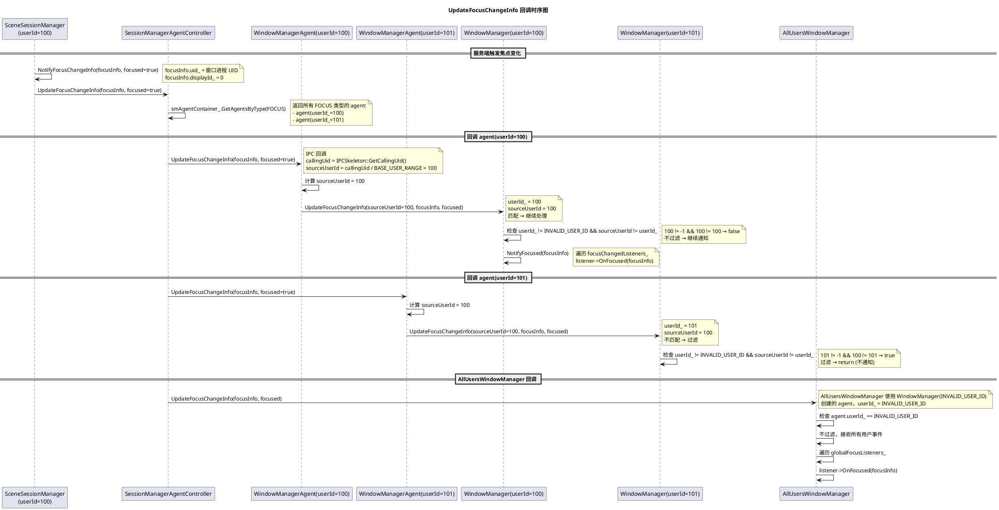

#### 4.3.3 用户激活时 activeUserIds 维护时序图

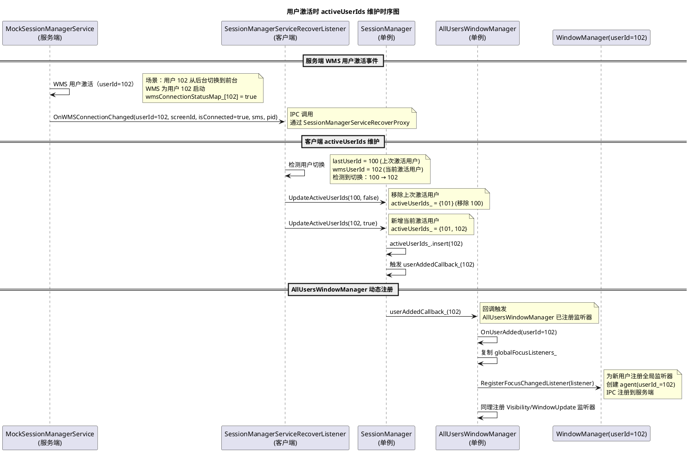

#### 4.3.4 SessionManager OnWMSConnectionChanged 时序图

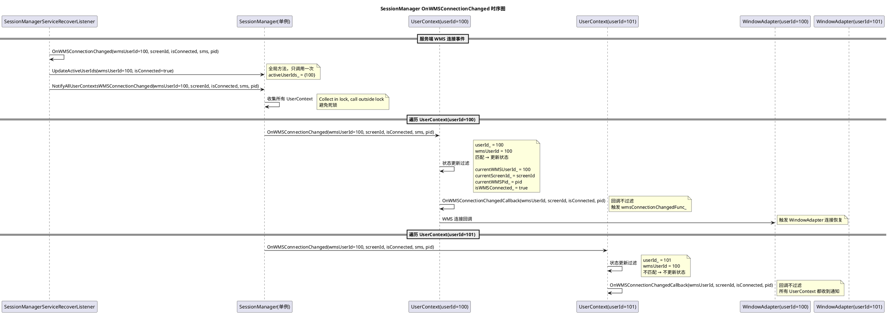

---

## 五、核心改动方案

### 5.1 WindowManager 独立 Agent 方案（已完成）

**改动点**：

| 改动项 | 改动前 | 改动后 |
|--------|--------|--------|
| focusChangedListenerAgent_ | static 静态变量，共享 | 实例变量，每个 userId 独立 |
| Agent 创建 | userId_=INVALID_USER_ID | userId_=实例 userId |
| 服务端存储 | pid → type → agent（二层） | pid → instanceUserId → type → agent（三层） |
| 客户端过滤 | registeredUserIds_ 集合分发 | userId_ == sourceUserId 过滤 |

**关键代码示例**：

```cpp
// window_manager.cpp
class WindowManager::Impl {
    sptr<WindowManagerAgent> focusChangedListenerAgent_ = nullptr; // 实例变量
    ListenerSet<IFocusChangedListener> focusChangedListeners_;
};

WMError WindowManager::RegisterFocusChangedListener(const sptr<IFocusChangedListener>& listener) {
    if (pImpl_->focusChangedListenerAgent_ == nullptr) {
        pImpl_->focusChangedListenerAgent_ = sptr<WindowManagerAgent>::MakeSptr(userId_);
    }
    pImpl_->focusChangedListeners_.insert(listener);
    return WindowAdapter::GetInstance(userId_).RegisterWindowManagerAgent(type, agent);
}

void WindowManagerAgent::UpdateFocusChangeInfo(...) {
    int32_t sourceUserId = IPCSkeleton::GetCallingUid() / BASE_USER_RANGE;
    if (userId_ == INVALID_USER_ID || userId_ == sourceUserId) {
        WindowManager::GetInstance(userId_).UpdateFocusChangeInfo(sourceUserId, ...);
    }
}

// session_manager_agent_controller.cpp
WMError SessionManagerAgentController::RegisterWindowManagerAgent(agent, type, pid, instanceUserId) {
    windowManagerAgentMap_[pid][instanceUserId][type] = agent;
}
```

### 5.2 SessionManager 多实例模式（实际实现）

**设计说明**：
- SessionManager 采用多实例模式（GetInstance(userId)），而非单例+UserContext模式
- 静态变量（activeUserIds_、sessionManagerMap_）共享，实例变量独立
- 只有默认实例（userId=-1）负责维护 activeUserIds_ 和触发回调

**改动点**：

| 改动项 | 说明 |
|--------|------|
| 实例模式 | 多实例：GetInstance(userId) 获取特定用户实例，GetInstance() 获取默认实例(userId=-1) |
| activeUserIds_ | 静态变量，所有实例共享，只有默认实例维护 |
| SMSRecoverListener | 每个实例独立注册，服务端按 userId 区分 |
| UpdateActiveUserIds | userId!=-1 时跳过执行，避免多实例重复更新 |
| 回调触发 | 只有默认实例触发 userAddedCallbackFunc_ 和 userRemovedCallbackFunc_ |

**关键代码示例**：

```cpp
// session_manager.h
class SessionManager : public RefBase {
    WM_DECLARE_SINGLE_INSTANCE_BASE(SessionManager);
    
    // 实例变量
    const int32_t userId_;
    sptr<ISceneSessionManager> sceneSessionManagerProxy_;
    int32_t currentWMSUserId_;
    bool isWMSConnected_;
    
    UserAddedCallbackFunc userAddedCallbackFunc_;  // 只有默认实例使用
    UserRemovedCallbackFunc userRemovedCallbackFunc_;  // 只有默认实例使用
    
    // 静态变量（共享）
    static std::unordered_map<int32_t, sptr<SessionManager>> sessionManagerMap_;
    static std::unordered_set<int32_t> activeUserIds_;
    static bool activeUserIdsInitialized_;
    
    // 获取实例
    static SessionManager& GetInstance(const int32_t userId);
    
    // 全局方法
    void GetActiveUserIds(std::vector<int32_t>& userIds);
    void UpdateActiveUserIds(int32_t userId, bool isConnected);
};

// session_manager.cpp
SessionManager& SessionManager::GetInstance(const int32_t userId) {
    if (userId <= INVALID_USER_ID) {
        return GetInstance();  // 默认实例
    }
    std::lock_guard<std::mutex> lock(sessionManagerMapMutex_);
    auto iter = sessionManagerMap_.find(userId);
    if (iter != sessionManagerMap_.end()) {
        return *iter->second;
    }
    auto instance = sptr<SessionManager>::MakeSptr(userId);
    sessionManagerMap_.insert({ userId, instance });
    return *sessionManagerMap_[userId];
}

void SessionManager::UpdateActiveUserIds(int32_t userId, bool isConnected) {
    if (userId < INVALID_USER_ID || userId_ != INVALID_USER_ID) {
        return;  // 多实例跳过，只有默认实例执行
    }
    
    std::lock_guard<std::mutex> lock(activeUserIdsMutex_);
    if (isConnected) {
        activeUserIds_.insert(userId);
        if (userAddedCallbackFunc_) {
            userAddedCallbackFunc_(userId);  // 只有默认实例触发
        }
    } else {
        activeUserIds_.erase(userId);
        if (userRemovedCallbackFunc_) {
            userRemovedCallbackFunc_(userId);  // 只有默认实例触发
        }
    }
}

void SessionManager::OnFoundationDied() {
    // 清理实例变量
    sceneSessionManagerProxy_ = nullptr;
    isRecoverListenerRegistered_ = false;
    smsRecoverListener_ = nullptr;
    
    // 清理静态变量（只有默认实例需要清理）
    {
        std::lock_guard<std::mutex> lock(activeUserIdsMutex_);
        activeUserIds_.clear();
        activeUserIdsInitialized_ = false;
    }
}
```

**关键 Bug 修复**：

1. **UpdateActiveUserIds 重复调用**：userId!=-1 时跳过，避免多实例重复更新
2. **OnFoundationDied 清理不完整**：添加清理 activeUserIds_、activeUserIdsInitialized_、smsRecoverListener_
3. **IPC Identity 修复**：RegisterSMSRecoverListener 在 IPC 调用前 ResetCallingIdentity

### 5.3 AllUsersWindowManager 聚合管理方案（已完成）

**核心诉求**：SA 不感知 userId，通过单例类聚合所有前台用户的窗口数据和事件监听。

**改动点**：

| 改动项 | 改动前 | 改动后 |
|--------|--------|--------|
| 类设计 | 无 | 新增单例类 AllUsersWindowManager |
| 聚合查询 | 需遍历 userId 手动调用 | 一接口聚合所有用户数据 |
| 聚合监听 | 需向每个 userId 注册 | 一接口自动注册所有用户（Focus/Visibility） |
| 用户管理 | 无动态机制 | 自动监听用户增减事件 |

**核心实现**：

```cpp
// all_users_window_manager.h（实际实现）
class AllUsersWindowManager : public RefBase {
    WM_DECLARE_SINGLE_INSTANCE(AllUsersWindowManager);
public:
    // 聚合查询接口
    std::unordered_set<int32_t> GetActiveUserIds() const;
    WMError GetVisibilityWindowInfo(std::vector<sptr<WindowVisibilityInfo>>& infos) const;
    WMError GetAccessibilityWindowInfo(std::vector<sptr<AccessibilityWindowInfo>>& infos) const;
    WMError GetAllMainWindowInfo(std::vector<sptr<MainWindowInfo>>& infos) const;
    
    // 聚合监听接口（只有 Focus 和 Visibility）
    WMError RegisterFocusChangedListener(const sptr<IFocusChangedListener>& listener);
    WMError UnregisterFocusChangedListener(const sptr<IFocusChangedListener>& listener);
    WMError RegisterVisibilityChangedListener(const sptr<IVisibilityChangedListener>& listener);
    WMError UnregisterVisibilityChangedListener(const sptr<IVisibilityChangedListener>& listener);
    
private:
    void OnUserAdded(int32_t userId);   // 用户激活时自动注册全局监听器
    void OnUserRemoved(int32_t userId); // 用户退出时清理 WindowManagerLite
    void RegisterUserChangeListeners(); // 注册用户增减监听
    
    // 全局监听器集合（静态）- 只有 Focus 和 Visibility
    static std::unordered_set<sptr<IFocusChangedListener>, SptrHash<IFocusChangedListener>> globalFocusListeners_;
    static std::unordered_set<sptr<IVisibilityChangedListener>, SptrHash<IVisibilityChangedListener>> globalVisibilityListeners_;
    static std::mutex globalListenersMutex_;
    
    std::mutex operationMutex_;
    bool userChangeListenersRegistered_ = false;
};

// all_users_window_manager.cpp
void AllUsersWindowManager::OnUserAdded(int32_t userId) {
    // 复制监听器集合，避免锁内调用
    auto focusListeners = globalFocusListeners_;
    auto visibilityListeners = globalVisibilityListeners_;
    
    // 为新用户注册所有全局监听器
    for (const auto& listener : focusListeners) {
        WindowManager::GetInstance(userId).RegisterFocusChangedListener(listener);
    }
    for (const auto& listener : visibilityListeners) {
        WindowManager::GetInstance(userId).RegisterVisibilityChangedListener(listener);
    }
}

void AllUsersWindowManager::OnUserRemoved(int32_t userId) {
    // 清理 WindowManagerLite 实例
    WindowManagerLite::RemoveInstanceByUserId(userId);
}
```

**注意**：
- RegisterWindowUpdateListener 已被删除（不再支持）
- globalWindowUpdateListeners_ 不存在
- OnUserRemoved 只清理 WindowManagerLite，不清理 SessionManager

**使用示例（车机任务管理 SA）**：

```cpp
// 任务管理 SA - 不感知 userId，聚合获取所有用户主窗口
std::vector<sptr<MainWindowInfo>> allMainWindows;
AllUsersWindowManager::GetInstance().GetAllMainWindowInfo(allMainWindows);

// 返回：中控(userId=100) + 副驾(userId=101) + 后排(userId=102) 的所有主窗口
for (const auto& info : allMainWindows) {
    TLOGI(WmsLogTag::WMS_MULTI_USER, "Window: %{public}s, userId: %{public}d",
        info->windowName_, info->uid_ / BASE_USER_RANGE);
}

// 注册焦点监听 - 一次注册监听所有用户焦点变化
sptr<MyFocusListener> listener = sptr<MyFocusListener>::MakeSptr();
AllUsersWindowManager::GetInstance().RegisterFocusChangedListener(listener);

// 后续：中控/副驾/后排任意用户焦点变化都触发回调
// 用户切换（新用户激活）时自动生效，无需重新注册
```

### 5.4 WindowAdapter（多实例模式）

**说明**：WindowAdapter 采用多实例模式，与 SessionManager 架构一致。

| 改动项 | 说明 |
|--------|------|
| 实例模式 | GetInstance(userId) 多实例 |
| userId_ | 实例成员 |
| wmsProxy_ | 每实例独立代理 |
| 方法数量 | ~130 个 |

---

## 六、数据结构设计

### 6.1 服务端三层 Map 结构

```cpp
// SessionManagerAgentController 存储
std::map<int32_t, std::map<int32_t, std::map<WindowManagerAgentType, sptr<IWindowManagerAgent>>> windowManagerAgentMap_;

// 结构: windowManagerAgentMap_[pid][instanceUserId][type] = agent

// 反向索引
std::map<sptr<IRemoteObject>, std::tuple<int32_t, int32_t, WindowManagerAgentType>> windowManagerAgentPairMap_;
// pairMap_[agent] = {pid, instanceUserId, type}
```

### 6.2 客户端多实例 Map 结构（实际实现）

```cpp
// SessionManager 存储（静态变量）
static std::unordered_map<int32_t, sptr<SessionManager>> sessionManagerMap_;  // [userId] = instance
static std::unordered_set<int32_t> activeUserIds_;  // 活跃用户集合
static bool activeUserIdsInitialized_;  // 初始化标志

// WindowManager 存储（静态变量）
static std::unordered_map<int32_t, sptr<WindowManager>> windowManagerMap_;  // [userId] = instance

// WindowManagerLite 存储（静态变量）
static std::unordered_map<int32_t, sptr<WindowManagerLite>> windowManagerLiteMap_;  // [userId] = instance
```

---

## 七、风险评估

| 风险项 | 级别 | 说明 | 缓解措施 |
|--------|------|------|---------|
| IPC 参数扩展 | 🟡 中 | instanceUserId 参数新增 | Proxy/Stub 同步修改，顺序一致 |
| 服务端存储扩展 | 🟡 中 | 三层 Map 新增维度 | 保持原有二层逻辑，增量添加 |
| 客户端过滤逻辑 | 🟢 低 | userId_ 过滤新增 | 简单条件判断，逻辑清晰 |
| SessionManager 多实例 | 🟢 低 | UpdateActiveUserIds 多实例调用 | userId!=-1 时跳过执行 |
| Foundation 死亡清理 | 🟡 中 | OnFoundationDied 清理不完整 | 添加清理 activeUserIds_、activeUserIdsInitialized_、smsRecoverListener_ |
| 线程安全 | 🟢 低 | 实例变量独立 mutex | 每个实例独立锁，无竞态 |
| 功能回归 | 🟡 中 | 多用户场景需验证 | 充分测试多用户场景 |

---

## 八、测试场景

### 8.1 功能测试场景

| 场景 | 操作 | 预期结果 |
|------|------|---------|
| 单用户注册 | WindowManager(100) 注册焦点监听 | userId=100 收到回调 |
| 多用户注册 | WindowManager(100/101) 分别注册 | 各 userId 收到对应回调 |
| AllUsers 注册 | AllUsersWindowManager 注册 | 所有活跃 userId 收到回调 |
| 用户切换 | 100→101 切换 | activeUserIds 更新 |
| Agent 覆盖测试 | 同进程不同 userId 注册 | 服务端三层 Map 不覆盖 |
| SessionManager 多实例 | 多 userId 获取实例 | 状态独立，activeUserIds 共享 |
| WMS 连接/断开 | 单个 userId WMS 连接 | 各实例状态正确更新 |
| Foundation 死亡 | Foundation 重启 | activeUserIds 清空，重新初始化 |

### 8.2 性能测试场景

| 场景 | 测试点 | 预期 |
|------|--------|------|
| 多 Agent 注册 | 10 个 userId 注册 | IPC 调用次数 10，存储正确 |
| 回调分发 | 焦点变化触发 | 正确分发到对应 userId |
| SessionManager 回调 | WMS 连接触发 | 默认实例触发 userAdded 回调 |
| 内存占用 | 多 userId 场景 | 每个 userId 独立 agent/instance，内存可控 |

---

## 九、实施计划

### 9.1 Phase 1：WindowManager 独立 Agent 方案（已完成）

| 步骤 | 内容 | 状态 |
|------|------|------|
| 1.1 | WindowManager agent 实例化 | ✅ |
| 1.2 | WindowAdapter userId_ 参数传递 | ✅ |
| 1.3 | IPC instanceUserId 参数扩展 | ✅ |
| 1.4 | SessionManagerAgentController 三层 Map | ✅ |
| 1.5 | WindowManagerAgent userId_ 过滤 | ✅ |

### 9.2 Phase 2：SessionManager 多实例模式优化（已完成）

| 步骤 | 内容 | 状态 |
|------|------|------|
| 2.1 | UpdateActiveUserIds userId!=-1 跳过执行 | ✅ |
| 2.2 | 全局方法：GetActiveUserIds, UpdateActiveUserIds | ✅ |
| 2.3 | 默认实例触发 userAdded/userRemoved 回调 | ✅ |
| 2.4 | OnFoundationDied 清理 activeUserIds_ 和 activeUserIdsInitialized_ | ✅ |
| 2.5 | OnFoundationDied 清理 smsRecoverListener_ | ✅ |
| 2.6 | IPC Identity 修复 | ✅ |
| 2.7 | SessionManagerLite 同步修改 | ✅ |

### 9.3 Phase 3：AllUsersWindowManager 改动（已完成）

| 步骤 | 内容 | 状态 |
|------|------|------|
| 3.1 | activeUserIds 获取 | ✅ |
| 3.2 | 遍历注册逻辑 | ✅ |
| 3.3 | 聚合数据接口 | ✅ |

### 9.4 Phase 4：测试验证（待执行）

| 步骤 | 内容 | 状态 |
|------|------|------|
| 4.1 | 单元测试更新 | ⏸️ |
| 4.2 | 多用户场景测试 | ⏸️ |
| 4.3 | 性能测试 | ⏸️ |

### 9.5 Phase 5：WindowAdapter 重构（待执行）

| 步骤 | 内容 | 状态 |
|------|------|------|
| 5.1 | 单例 + UserContext 架构 | ⏸️ |
| 5.2 | 方法迁移（约130个） | ⏸️ |
| 5.3 | 调用方改动（约80处） | ⏸️ |

---

## 十、关键文件清单

| 文件路径 | 改动类型 | 关键内容 |
|---------|---------|---------|
| `wm/src/window_manager.cpp` | 核心改动 | focusChangedListenerAgent_ 实例化 |
| `wm/src/window_manager_agent.cpp` | 核心改动 | userId_ 过滤逻辑 |
| `wm/src/window_adapter.cpp` | 核心改动 | userId_ 参数传递 |
| `wm/src/window_adapter_lite.cpp` | 核心改动 | userId_ 参数传递 |
| `wm/src/all_users_window_manager.cpp` | 新增 | 聚合管理类 |
| `window_scene/session_manager/src/session_manager.cpp` | 核心改动 | 单例 + UserContext |
| `window_scene/session_manager/src/session_manager_agent_controller.cpp` | 核心改动 | 三层 Map 存储 |
| `window_scene/session_manager/src/scene_session_manager.cpp` | 核心改动 | instanceUserId 参数 |
| `window_scene/session_manager/src/zidl/*.cpp` | IPC 改动 | instanceUserId 序列化 |
| `wmserver/src/zidl/*.cpp` | IPC 改动 | instanceUserId 序列化 |
| `wmserver/src/mock_session_manager_service.cpp` | Mock 改动 | GetActiveUserIds, UpdateForegroundUserIds |

---

## 十一、AllUsersWindowManager 设计问题深度分析

### 11.1 当前实现分析

#### 11.1.1 核心设计模式

```cpp
// 当前实现：静态全局监听器集合 + 遍历注册模式（简化示意）
class AllUsersWindowManager {
    // 静态全局监听器集合（实际有三个：Focus/Visibility/WindowUpdate）
    static std::unordered_set<sptr<IFocusChangedListener>> globalFocusListeners_;
    static std::mutex globalListenersMutex_;
    
    // 注册时：向所有活跃用户的 WindowManager 注册同一个 listener
    WMError RegisterFocusChangedListener(listener) {
        globalFocusListeners_.insert(listener);  // 存储到全局集合
        for (userId : GetActiveUserIds()) {      // 从 MockSessionManagerService 获取
            WindowManager::GetInstance(userId).RegisterFocusChangedListener(listener);
        }
    }
    
    // 用户激活时：向新用户注册所有全局监听器
    void OnUserAdded(userId) {
        for (listener : globalFocusListeners_) {
            WindowManager::GetInstance(userId).RegisterFocusChangedListener(listener);
        }
    }
};
```

#### 11.1.2 业界方案对比

| 方案 | 系统 | 设计模式 | 优点 | 缺点 |
|------|------|---------|------|------|
| **Android WindowManager** | Android | 进程级单例 + UserHandle | 每个进程独立管理，UserHandle 传递 userId | 需要显式传递 userId |
| **Windows User Session** | Windows | Session 隔离 + Global Hook | 每个 Session 完全隔离，Global Hook 需特殊权限 | 跨 Session 需要特殊机制 |
| **Chrome Multi-Profile** | Chrome | Profile 对象 + 事件聚合 | 每个 Profile 独立事件总线，聚合层订阅所有 Profile | 聚合层需要管理订阅关系 |
| **Current OpenHarmony** | OpenHarmony | 静态集合 + 遍历注册 | 简单易用，SA 无需感知 userId | 多问题（详见下文） |

### 11.2 设计问题分析

#### 11.2.1 🟡 设计约束一：同一个 listener 注册到多个 WindowManager 实例

**设计说明**：
- 同一个 `IFocusChangedListener` 对象被注册到多个 `WindowManager(userId)` 实例
- 每个 `WindowManager(userId)` 有独立的 `WindowManagerAgent(userId_)` 和 `focusChangedListeners_` 集合
- **这是 IPC 回调的标准设计惯例，不是 bug**

**代码路径**：
```cpp
// all_users_window_manager.cpp:160
for (int32_t userId : activeUserIds) {
    WindowManager::GetInstance(userId).RegisterFocusChangedListener(listener);
}

// window_manager.cpp:810
pImpl_->focusChangedListenerAgent_ = sptr<WindowManagerAgent>::MakeSptr(userId_);  // 每个 userId 独立 agent

// window_manager.cpp:814
pImpl_->focusChangedListeners_.insert(listener);  // 每个 WindowManager(userId) 独立存储
```

**保护机制分析**：

| 保护层 | 机制 | 作用 |
|-------|------|------|
| **userId 过滤** | `WindowManagerAgent::UpdateFocusChangeInfo` 检查 `userId_ == sourceUserId` | 阻止事件串扰，每个 agent 只处理匹配的事件 |
| **集合锁** | `focusChangedMutex_` 保护 `focusChangedListeners_` | 保护 listener 集合的复制，不保护回调执行 |
| **Binder 线程池** | IPC 回调在工作线程中执行 | 多个 userId 的事件可能并发回调 |

**userId 过滤逻辑**：
```cpp
// window_manager_agent.cpp:34
void WindowManagerAgent::UpdateFocusChangeInfo(const sptr<FocusChangeInfo>& focusChangeInfo, bool focused)
{
    int32_t sourceUserId = IPCSkeleton::GetCallingUid() / BASE_USER_RANGE;
    
    if (userId_ == INVALID_USER_ID || userId_ == sourceUserId) {
        // 只传递匹配的事件，阻止 userId 串扰
        WindowManager::GetInstance(userId_).UpdateFocusChangeInfo(sourceUserId, focusChangeInfo, focused);
    }
}
```

**并发回调分析**：

```
场景：userId=100 和 userId=101 的焦点变化同时发生

Server 端：
  userId=100 焦点变化 → 发送 IPC 给 agent(userId_=100)
  userId=101 焦点变化 → 发送 IPC 给 agent(userId_=101)

Client Binder 线程池：
  Binder 线程1: agent(userId_=100) → 过滤通过 → listener->OnFocused(focusInfo_100)
  Binder 线程2: agent(userId_=101) → 过滤通过 → listener->OnFocused(focusInfo_101)
  
结果：同一个 listener 可能被两个 Binder 工作线程并发调用
```

**风险评估**：

| listener 类型 | 风险 | 说明 |
|---------------|------|------|
| 只读操作（更新 UI） | 🟢 低 | 无共享状态，并发无问题 |
| 有状态（计数、缓存） | 🔴 高 | 用户需要自行加锁保护 |
| 访问外部资源（文件、DB） | 🟡 中 | 需要资源本身的线程安全 |

**业界对比**：

| 系统 | 回调线程 | 保护机制 |
|------|---------|---------|
| Android Binder | 线程池 | 用户自行保护 |
| OpenHarmony IPC | 线程池 | 用户自行保护 |
| Chrome Mojo | 线程池 | 用户自行保护 |

**结论**：

| 维度 | 结论 |
|------|------|
| 是否是 bug？ | ❌ 不是，是 IPC 回调的标准设计惯例 |
| 是否需要立即修复？ | ❌ 不需要 |
| 是否需要在文档中说明？ | ✅ 建议在 `IFocusChangedListener` 接口文档中添加线程安全提示 |
| 是否需要改进设计？ | 🟡 Phase 6 可选评估（聚合层包装器 + 互斥锁） |

**可选改进方案（Phase 6 评估）**：
```cpp
// 方案：聚合层包装器 + 互斥锁（增加复杂度，提供更安全的默认行为）
class AggregateFocusListener : public IFocusChangedListener {
    std::unordered_set<sptr<IFocusChangedListener>> listeners_;
    std::mutex mutex_;
    
    void OnFocused(focusInfo) {
        std::lock_guard<std::mutex> lock(mutex_);
        for (listener : listeners_) {
            listener->OnFocused(focusInfo);  // 在聚合层统一分发，控制并发
        }
    }
};
```

**文档建议**：
```
IFocusChangedListener 的回调可能在 Binder 工作线程中执行。
如果 listener 有共享状态，请确保线程安全。
AllUsersWindowManager 场景下，多个 userId 的事件可能并发回调。
```

#### 11.2.2 🔴 问题二：OnUserRemoved 没有清理机制

**问题描述**：
```cpp
// all_users_window_manager.cpp:371
void AllUsersWindowManager::OnUserRemoved(int32_t userId) {
    TLOGI(WmsLogTag::WMS_MULTI_USER, "User %{public}d removed", userId);
    // 只打印日志，没有注销该用户的监听器！
}
```

**潜在风险**：

| 风险类型 | 说明 | 严重程度 |
|---------|------|---------|
| **资源泄漏** | 用户退出后，其 agent 仍存在于服务端三层 Map 中 | 🔴 高 |
| **幽灵回调** | 用户退出后，如果该 userId 的 sceneboard 仍在运行，可能收到不应该收到的事件 | 🔴 高 |
| **状态不一致** | activeUserIds 已移除，但监听器未清理，导致状态不一致 | 🟡 中 |
| **累积泄漏** | 多次用户切换后，泄漏累积，可能导致性能问题 | 🟡 中 |

**代码分析**：
```cpp
// 服务端存储结构
windowManagerAgentMap_[pid][instanceUserId][type] = agent;

// 用户退出后
activeUserIds_.erase(userId);  // 客户端移除
// 但 agent 没有注销，服务端仍然持有
```

**改进建议**：
```cpp
void AllUsersWindowManager::OnUserRemoved(int32_t userId) {
    TLOGI(WmsLogTag::WMS_MULTI_USER, "User %{public}d removed", userId);
    
    // 1. 从全局集合获取所有 listener
    std::vector<sptr<IFocusChangedListener>> focusListeners;
    {
        std::lock_guard<std::mutex> lock(globalListenersMutex_);
        focusListeners.assign(globalFocusListeners_.begin(), globalFocusListeners_.end());
    }
    
    // 2. 从该用户注销所有监听器
    for (const auto& listener : focusListeners) {
        WindowManager::GetInstance(userId).UnregisterFocusChangedListener(listener);
    }
    
    // 3. 清理该用户的 WindowManager 实例（可选）
    WindowManager::RemoveInstanceByUserId(userId);
}
```

#### 11.2.3 🟡 问题三：SessionManager 用户监听器只支持单个回调

**问题描述**：
```cpp
// session_manager.cpp:231
void SessionManager::RegisterUserAddedListener(const UserAddedCallbackFunc& callbackFunc) {
    std::lock_guard<std::mutex> lock(userAddedCallbackFuncMutex_);
    userAddedCallbackFunc_ = callbackFunc;  // 直接赋值，覆盖之前的！
}
```

**潜在风险**：

| 风险类型 | 说明 | 严重程度 |
|---------|------|---------|
| **回调覆盖** | 多个 SA 注册用户监听器时，只有最后一个生效 | 🔴 高 |
| **事件丢失** | 第一个 SA 注册的回调被覆盖后，不再收到用户事件 | 🔴 高 |
| **竞态条件** | 多个 SA 同时注册时，不确定哪个生效 | 🟡 中 |

**场景示例**：
```cpp
// SA1: 任务管理服务
SessionManager::GetInstance().RegisterUserAddedListener([](int32_t userId) {
    TLOGI(WmsLogTag::WMS_MULTI_USER, "SA1: User added %{public}d", userId);
});

// SA2: 无障碍服务
SessionManager::GetInstance().RegisterUserAddedListener([](int32_t userId) {
    TLOGI(WmsLogTag::WMS_MULTI_USER, "SA2: User added %{public}d", userId);
});

// 结果：只有 SA2 的回调生效，SA1 被覆盖！
```

**改进建议**：
```cpp
// 方案一：支持多个回调（回调列表）
class SessionManager {
    std::vector<UserAddedCallbackFunc> userAddedCallbackFuncs_;
    std::mutex userAddedCallbackFuncsMutex_;
    
    void RegisterUserAddedListener(callbackFunc) {
        std::lock_guard<std::mutex> lock(userAddedCallbackFuncsMutex_);
        userAddedCallbackFuncs_.push_back(callbackFunc);  // 添加到列表，不覆盖
    }
    
    void UpdateActiveUserIds(userId, isConnected) {
        // 触发所有回调
        for (const auto& callback : userAddedCallbackFuncs_) {
            callback(userId);
        }
    }
};

// 方案二：观察者模式（推荐）
class IUserChangeListener : public RefBase {
    virtual void OnUserAdded(userId) = 0;
    virtual void OnUserRemoved(userId) = 0;
};

void SessionManager::RegisterUserChangeListener(sptr<IUserChangeListener> listener) {
    userChangeListeners_.insert(listener);
}
```

#### 11.2.4 🟡 问题四：注册失败没有重试机制

**问题描述**：
```cpp
// all_users_window_manager.cpp:345
void AllUsersWindowManager::OnUserAdded(int32_t userId) {
    for (const auto& listener : focusListeners) {
        auto ret = WindowManager::GetInstance(userId).RegisterFocusChangedListener(listener);
        if (ret != WMError::WM_OK) {
            TLOGE(...);  // 只打印日志，没有重试！
        }
    }
}
```

**潜在风险**：

| 风险类型 | 说明 | 严重程度 |
|---------|------|---------|
| **监听丢失** | 新用户激活后，如果注册失败，该用户的事件监听丢失 | 🔴 高 |
| **时序问题** | 用户激活时 WMS 可能还未完全就绪，注册容易失败 | 🟡 中 |
| **状态不一致** | 全局集合中有 listener，但某些 userId 未注册成功 | 🟡 中 |

**改进建议**：
```cpp
void AllUsersWindowManager::OnUserAdded(int32_t userId) {
    // 1. 重试机制
    int retryCount = 0;
    while (retryCount < MAX_RETRY_COUNT) {
        bool allSuccess = true;
        for (const auto& listener : focusListeners) {
            auto ret = WindowManager::GetInstance(userId).RegisterFocusChangedListener(listener);
            if (ret != WMError::WM_OK) {
                allSuccess = false;
                break;
            }
        }
        if (allSuccess) break;
        
        retryCount++;
        std::this_thread::sleep_for(std::chrono::milliseconds(RETRY_DELAY_MS));
    }
    
    // 2. 失败后记录待注册状态，后续补偿
    if (retryCount >= MAX_RETRY_COUNT) {
        pendingRegisterUserIds_.insert(userId);  // 记录待注册用户
    }
}

// 3. 定时检查补偿
void CheckPendingRegistrations() {
    for (userId : pendingRegisterUserIds_) {
        if (TryRegister(userId)) {
            pendingRegisterUserIds_.erase(userId);
        }
    }
}
```

#### 11.2.5 🟢 问题五：activeUserIds 获取时机非原子性

**问题描述**：
```cpp
// all_users_window_manager.cpp:156
auto activeUserIds = GetActiveUserIds();  // 步骤1：获取
for (int32_t userId : activeUserIds) {
    WindowManager::GetInstance(userId).RegisterFocusChangedListener(listener);  // 步骤2：遍历注册
}
```

**潜在风险**：

| 风险类型 | 说明 | 严重程度 |
|---------|------|---------|
| **注册不完整** | 步骤1和步骤2之间，用户状态可能变化 | 🟡 中 |
| **竞态条件** | 注册过程中用户切换，可能导致部分 userId 未注册 | 🟡 中 |
| **幽灵监听** | 用户退出后仍然注册了监听器 | 🟡 中 |

**改进建议**：
```cpp
// 方案一：在 SessionManager 锁内完成注册
void SessionManager::RegisterListenerForAllUsers(listener) {
    std::lock_guard<std::mutex> lock(activeUserIdsMutex_);
    for (userId : activeUserIds_) {
        WindowManager::GetInstance(userId).RegisterFocusChangedListener(listener);
    }
}

// 方案二：使用原子快照 + 补偿机制
WMError RegisterFocusChangedListener(listener) {
    auto snapshot = GetActiveUserIdsSnapshot();  // 原子快照
    WMError ret = RegisterToSnapshot(snapshot, listener);
    
    // 检查快照是否过期
    auto current = GetActiveUserIds();
    if (snapshot != current) {
        // 补偿：注册新增用户，注销移除用户
        CompensateRegistration(snapshot, current, listener);
    }
    return ret;
}
```

#### 11.2.6 🟢 问题六：单实例模式降级不一致

**问题描述**：
```cpp
// all_users_window_manager.cpp:32
#define CHECK_SINGLE_INSTANCE_LISTENER(methodName, listener) \
    if (!WindowManager::IsMultiInstanceEnabled()) { \
        return WindowManager::GetInstance().methodName(listener); \
    }

// 但同时：
globalFocusListeners_.insert(listener);  // 仍然插入全局集合
```

**潜在风险**：

| 风险类型 | 说明 | 严重程度 |
|---------|------|---------|
| **数据不一致** | 单实例模式时，globalFocusListeners_ 被插入但未使用 | 🟢 低 |
| **混淆使用** | 单实例模式和多实例模式行为不一致，容易混淆 | 🟢 低 |
| **资源浪费** | 单实例模式下，全局集合占用内存但无用 | 🟢 低 |

**改进建议**：
```cpp
WMError RegisterFocusChangedListener(listener) {
    if (!WindowManager::IsMultiInstanceEnabled()) {
        return WindowManager::GetInstance().RegisterFocusChangedListener(listener);
        // 单实例模式直接返回，不操作全局集合
    }
    
    // 多实例模式才操作全局集合
    RegisterUserChangeListeners();
    globalFocusListeners_.insert(listener);
    // ...
}
```

#### 11.2.7 🔴 问题七：中控用户切换无原子保证（车机特有问题）

**问题描述**：
车机场景中，中控屏用户切换（userId 变化）时，当前实现没有原子性保证：
- `OnUserRemoved(oldUserId)` 和 `OnUserAdded(newUserId)` 是两个独立回调
- 两者之间可能存在时间窗口
- 切换期间状态不一致

**代码路径**：
```cpp
// session_manager.cpp:96-99
if (isConnected && lastUserId > INVALID_USER_ID && lastUserId != wmsUserId) {
    SessionManager::GetInstance().UpdateActiveUserIds(lastUserId, false);  // 先移除旧用户
    SessionManager::GetInstance().UpdateActiveUserIds(wmsUserId, true);    // 再添加新用户
}

// 两个 UpdateActiveUserIds 分别触发：
// 1. UpdateActiveUserIds(lastUserId, false) → OnUserRemoved(lastUserId)
// 2. UpdateActiveUserIds(wmsUserId, true)  → OnUserAdded(wmsUserId)
// 这两个回调是独立的，不是原子操作！
```

**时间窗口分析**：

| 时间点 | 事件 | 状态 | 问题 |
|--------|------|------|------|
| **T1** | 服务端发送 WMS 连接事件(userId=103) | activeUserIds={100,101,102} | 正常 |
| **T2** | UpdateActiveUserIds(100, false) | activeUserIds={101,102} | 触发 OnUserRemoved(100)，只日志未清理 |
| **T3** | **时间窗口（状态不一致）** | activeUserIds={101,102} | 🔴 100已移除，103未添加 |
| **T4** | UpdateActiveUserIds(103, true) | activeUserIds={103,101,102} | 触发 OnUserAdded(103)，注册监听 |
| **T5** | 切换完成 | activeUserIds={103,101,102} | userId=100 的 agent 未清理（幽灵） |

**T3 时间窗口风险**：
```
如果此时查询：
- GetActiveUserIds() 返回 {101, 102}
- 但实际应该是 {103, 101, 102}

如果此时产生事件：
- userId=100 的 agent 仍在服务端（幽灵 agent）
- userId=103 的 agent 未注册
- 100 的事件可能触发回调（幽灵回调）
- 103 的事件不会触发回调（事件丢失）
```

**潜在风险**：

| 风险类型 | 说明 | 严重程度 |
|---------|------|---------|
| **时间窗口状态不一致** | T3 时刻查询结果不准确 | 🔴 高 |
| **事件丢失** | T3 时刻 userId=103 的焦点事件丢失 | 🔴 高 |
| **幽灵回调** | T3 时刻 userId=100 的焦点事件仍触发 | 🔴 高 |
| **SA 数据错误** | T3 时刻 SA 聚合数据不包含 userId=103 | 🟡 中 |
| **竞态查询** | 其他线程在 T3 时刻查询 activeUserIds，结果不一致 | 🟡 中 |

**改进建议**：
```cpp
// 方案一：原子切换（锁内完成）
void SessionManager::SwitchUserAtomic(int32_t oldUserId, int32_t newUserId) {
    std::lock_guard<std::mutex> lock(activeUserIdsMutex_);
    
    // 1. 在锁内完成状态更新
    activeUserIds_.erase(oldUserId);
    activeUserIds_.insert(newUserId);
    
    // 2. 在锁外触发回调（避免死锁）
    std::vector<int32_t> removedUsers = {oldUserId};
    std::vector<int32_t> addedUsers = {newUserId};
    
    // 锁外回调
    for (int32_t userId : removedUsers) {
        if (userRemovedCallback_) userRemovedCallback_(userId);
    }
    for (int32_t userId : addedUsers) {
        if (userAddedCallback_) userAddedCallback_(userId);
    }
}

// 方案二：用户切换事务（Transaction）
class UserSwitchTransaction {
    int32_t oldUserId_;
    int32_t newUserId_;
    bool committed_ = false;
    
    void Begin() {
        // 标记切换开始，阻塞其他切换
    }
    
    void Commit() {
        // 原子完成切换
        // 1. 注销旧用户
        // 2. 注册新用户
        // 3. 更新 activeUserIds
        committed_ = true;
    }
    
    void Rollback() {
        // 回滚切换
        committed_ = false;
    }
};

// 方案三：双缓冲 activeUserIds
class SessionManager {
    std::unordered_set<int32_t> activeUserIdsCurrent_;   // 当前生效
    std::unordered_set<int32_t> activeUserIdsPending_;   // 待切换
    
    void BeginSwitch(oldUserId, newUserId) {
        activeUserIdsPending_ = activeUserIdsCurrent_;
        activeUserIdsPending_.erase(oldUserId);
        activeUserIdsPending_.insert(newUserId);
    }
    
    void CommitSwitch() {
        activeUserIdsCurrent_ = activeUserIdsPending_;  // 原子切换
        // 触发回调
    }
};
```

### 11.3 使用场景风险分析

#### 11.3.1 🔴 风险场景一：多 SA 并发注册

```cpp
// 场景：多个 SA 同时注册用户监听器
// SA1 (任务管理)
AllUsersWindowManager::GetInstance().RegisterFocusChangedListener(listener1);

// SA2 (无障碍服务)
AllUsersWindowManager::GetInstance().RegisterFocusChangedListener(listener2);

// 问题：
// 1. globalFocusListeners_ 包含 {listener1, listener2}
// 2. SessionManager.userAddedCallbackFunc_ 只保存 listener2 的注册回调（覆盖）
// 3. 新用户激活时，OnUserAdded 会尝试注册 listener1 和 listener2
// 4. 但 listener1 的用户监听回调被覆盖，无法感知新用户
```

**修复方案**：
- SessionManager 支持多个用户监听回调（列表模式）
- 或每个 SA 独立创建 AllUsersWindowManager 子类

#### 11.3.2 🔴 风险场景二：用户快速切换

```cpp
// 场景：用户快速切换
// 时间线：
// T1: userId=100 激活，注册监听器
// T2: userId=100 退出，userId=101 激活
// T3: userId=101 注册监听器（OnUserAdded）
// T4: userId=100 的 sceneboard 仍运行，产生焦点事件

// 问题：
// 1. userId=100 退出时，OnUserRemoved 只打印日志，未清理
// 2. userId=100 的 agent 仍存在于服务端
// 3. T4 时，userId=100 的 agent 可能收到事件
// 4. 客户端过滤：userId_=100 vs sourceUserId=100 → 匹配 → 触发回调
// 5. 但此时 activeUserIds={101}，userId=100 已不应该接收事件
```

**修复方案**：
- OnUserRemoved 必须注销该用户的监听器
- 或服务端检查 activeUserIds，只向活跃用户发送回调

#### 11.3.3 🟡 风险场景三：Listener 实现并发问题

```cpp
// 场景：SA 的 listener 实现包含共享状态
class MyFocusListener : public IFocusChangedListener {
    int focusCount_ = 0;  // 共享状态
    
    void OnFocused(focusInfo) {
        focusCount_++;  // 非线程安全！
        TLOGI(WmsLogTag::DEFAULT, "Focus count: %{public}d", focusCount_);
    }
};

// 问题：
// 1. userId=100 和 userId=101 同时焦点变化
// 2. 两个线程并发调用 OnFocused
// 3. focusCount_++ 存在数据竞争
// 4. 可能导致 focusCount_ 计数不准确，甚至崩溃
```

**修复方案**：
- listener 实现必须线程安全（使用锁或原子操作）
- 或聚合层统一分发，避免并发回调

#### 11.3.4 🔴 风险场景四：中控用户切换（车机特有场景）

**场景描述**：
车机多屏多用户场景中，中控屏（主驾）可能会切换用户：
- 原状态：中控屏(userId=100)、副驾屏(userId=101)、后排屏(userId=102)
- 切换后：中控屏(userId=103)、副驾屏(userId=101)、后排屏(userId=102)

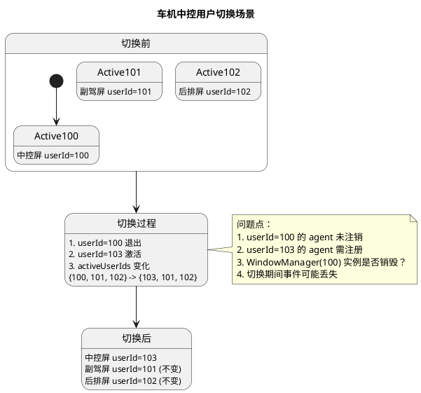

**当前实现问题分析**：

```cpp
// 时间线分析
// T1: SA 调用 AllUsersWindowManager::RegisterFocusChangedListener(listener)
//     - activeUserIds = {100, 101, 102}
//     - globalFocusListeners_.insert(listener)
//     - WindowManager(100).RegisterFocusChangedListener(listener) → agent(userId=100) 注册到服务端
//     - WindowManager(101).RegisterFocusChangedListener(listener) → agent(userId=101)
//     - WindowManager(102).RegisterFocusChangedListener(listener) → agent(userId=102)
//     服务端存储：
//     [pid][100][FOCUS] = agent(userId=100)
//     [pid][101][FOCUS] = agent(userId=101)
//     [pid][102][FOCUS] = agent(userId=102)

// T2: 用户切换：userId=100 退出，userId=103 激活
// SessionManager::UpdateActiveUserIds(100, false)  // 移除 100
// SessionManager::UpdateActiveUserIds(103, true)   // 添加 103
// 触发回调：
// - OnUserRemoved(100) → 只打印日志！未清理 agent
// - OnUserAdded(103)   → 注册 listener 到 WindowManager(103)

// T3: activeUserIds = {103, 101, 102}
//     globalFocusListeners_ = {listener}
//     
//     服务端存储：
//     [pid][100][FOCUS] = agent(userId=100)  ← 未清理！幽灵 agent
//     [pid][101][FOCUS] = agent(userId=101)
//     [pid][102][FOCUS] = agent(userId=102)
//     [pid][103][FOCUS] = agent(userId=103)  ← 新注册

// T4: userId=100 的 sceneboard 可能仍在运行（用户切换后进程未杀）
//     产生焦点事件 → 服务端回调所有 agent
//     [pid][100][FOCUS].UpdateFocusChangeInfo() → 被调用！
//     agent(userId=100) 回调 → WindowManager(100).UpdateFocusChangeInfo()
//     
//     问题：
//     1. WindowManager(100) 实例可能仍存在（未销毁）
//     2. focusChangedListeners_ 可能包含 listener
//     3. listener->OnFocused() 被调用
//     4. SA 收到 userId=100 的焦点事件，但此时 activeUserIds={103, 101, 102}
//     5. 如果 SA 过滤 sourceUserId，发现 100 不在 activeUserIds 中，可能忽略
//     6. 但如果 SA 未过滤，就会收到"幽灵事件"
```

**潜在风险表**：

| 风险类型 | 说明 | 严重程度 |
|---------|------|---------|
| **幽灵回调** | userId=100 退出后仍收到焦点事件，SA 可能处理错误数据 | 🔴 高 |
| **资源泄漏** | agent(userId=100) 未注销，服务端三层 Map 持有无效引用 | 🔴 高 |
| **实例堆积** | WindowManager(100) 未销毁，多次切换后实例堆积（最多 20 个） | 🟡 中 |
| **事件混乱** | 切换期间短暂时间窗口，可能同时收到 userId=100 和 userId=103 的事件 | 🔴 高 |
| **状态不一致** | activeUserIds 与实际监听用户不匹配 | 🔴 高 |
| **数据污染** | SA 聚合数据时，可能包含已退出用户的窗口信息 | 🟡 中 |

**特殊场景：同一 listener 双重注册**

```cpp
// 场景：SA 先向 WindowManager(100) 注册，再向 AllUsersWindowManager 注册
// T1: WindowManager::GetInstance(100).RegisterFocusChangedListener(listener);
//     - WindowManager(100).focusChangedListeners_.insert(listener)
//     - agent(userId=100) 注册到服务端
//     
// T2: AllUsersWindowManager::GetInstance().RegisterFocusChangedListener(listener);
//     - globalFocusListeners_.insert(listener)
//     - WindowManager(100).RegisterFocusChangedListener(listener)  // 重复注册！
//     - WindowManager(101).RegisterFocusChangedListener(listener)
//     - WindowManager(102).RegisterFocusChangedListener(listener)
//     
//     问题：
//     1. WindowManager(100).focusChangedListeners_ 中 listener 可能重复插入
//     2. 同一个 agent(userId=100) 可能被多次注册（或被覆盖）
//     3. 用户切换后：
//        - AllUsersWindowManager.OnUserRemoved(100) → 未清理
//        - WindowManager(100) 实例可能仍持有 listener
//        - 如果 WindowManager(100) 实例被销毁，listener 的引用计数减少
//        - 可能导致 listener 被提前释放
```

**改进方案**：

```cpp
// 方案一：OnUserRemoved 完整清理
void AllUsersWindowManager::OnUserRemoved(int32_t userId) {
    TLOGI(WmsLogTag::WMS_MULTI_USER, "User %{public}d removed, cleaning up", userId);
    
    // 1. 获取全局监听器列表
    std::vector<sptr<IFocusChangedListener>> focusListeners;
    std::vector<sptr<IVisibilityChangedListener>> visibilityListeners;
    std::vector<sptr<IWindowUpdateListener>> windowUpdateListeners;
    {
        std::lock_guard<std::mutex> lock(globalListenersMutex_);
        focusListeners.assign(globalFocusListeners_.begin(), globalFocusListeners_.end());
        visibilityListeners.assign(globalVisibilityListeners_.begin(), globalVisibilityListeners_.end());
        windowUpdateListeners.assign(globalWindowUpdateListeners_.begin(), globalWindowUpdateListeners_.end());
    }
    
    // 2. 从该用户注销所有监听器
    for (const auto& listener : focusListeners) {
        WindowManager::GetInstance(userId).UnregisterFocusChangedListener(listener);
    }
    for (const auto& listener : visibilityListeners) {
        WindowManager::GetInstance(userId).UnregisterVisibilityChangedListener(listener);
    }
    for (const auto& listener : windowUpdateListeners) {
        WindowManager::GetInstance(userId).UnregisterWindowUpdateListener(listener);
    }
    
    // 3. 销毁 WindowManager 实例（可选，取决于是否有其他使用）
    WindowManager::RemoveInstanceByUserId(userId);
    
    // 4. 清理 SessionManager 的 UserContext（可选）
    // SessionManager::GetInstance().RemoveUserContext(userId);
}

// 方案二：服务端 activeUserIds 过滤
void SessionManagerAgentController::UpdateFocusChangeInfo(focusInfo, focused) {
    auto agents = smAgentContainer_.GetAgentsByType(FOCUS);
    auto activeUserIds = GetActiveUserIds();  // 从 SessionManager 获取
    
    for (const auto& agent : agents) {
        // 从 pairMap 获取 agent 的 instanceUserId
        auto [pid, instanceUserId, type] = pairMap_[agent.AsObject()];
        
        // 只向活跃用户发送回调
        if (activeUserIds.find(instanceUserId) != activeUserIds.end()) {
            agent->UpdateFocusChangeInfo(focusInfo, focused);
        } else {
            TLOGD(WmsLogTag::WMS_MULTI_USER, 
                "Skip callback for inactive user %{public}d", instanceUserId);
        }
    }
}

// 方案三：用户切换原子操作
void SessionManager::SwitchUser(int32_t oldUserId, int32_t newUserId) {
    std::lock_guard<std::mutex> lock(switchMutex_);
    
    // 1. 先注销旧用户
    if (userRemovedCallback_) {
        userRemovedCallback_(oldUserId);  // AllUsersWindowManager.OnUserRemoved
    }
    
    // 2. 更新 activeUserIds
    activeUserIds_.erase(oldUserId);
    activeUserIds_.insert(newUserId);
    
    // 3. 再注册新用户
    if (userAddedCallback_) {
        userAddedCallback_(newUserId);  // AllUsersWindowManager.OnUserAdded
    }
    
    TLOGI(WmsLogTag::WMS_MULTI_USER, 
        "User switch completed: %{public}d -> %{public}d", oldUserId, newUserId);
}
```

**车机场景最佳实践**：

```cpp
// 建议：SA 使用 AllUsersWindowManager 时，不直接使用 WindowManager(userId)
// 原因：避免双重注册、生命周期管理混乱

// 错误用法：
WindowManager::GetInstance(100).RegisterFocusChangedListener(listener);  // 不要这样用！
AllUsersWindowManager::GetInstance().RegisterFocusChangedListener(listener);  // 导致双重注册

// 正确用法：
AllUsersWindowManager::GetInstance().RegisterFocusChangedListener(listener);  // 只用聚合类

// 如果需要单独监听某个用户：
// 方案：使用独立的 listener 对象
auto globalListener = sptr<GlobalFocusListener>::MakeSptr();
AllUsersWindowManager::GetInstance().RegisterFocusChangedListener(globalListener);

auto specificListener = sptr<User100FocusListener>::MakeSptr();  // 独立对象！
WindowManager::GetInstance(100).RegisterFocusChangedListener(specificListener);
```

### 11.4 改进方案建议

#### 11.4.1 方案一：独立聚合 Agent + 回调队列

##### 核心理念（一句话）

**"把 listener 和 agent 分开，每个用户有自己的'代理人'，代理人只负责收消息，由专门的人统一发货"**

##### 当前方案的问题（通俗解释）

```
场景：系统有3个用户：中控(userId=100)、副驾(userId=101)、后排(userId=102)

SA（任务管理服务）想要监听所有用户的焦点变化

当前做法：
1. SA 创建一个 listener 对象（一个"监听员")
2. 把这个 listener 同时注册给 WindowManager(100)、WindowManager(101)、WindowManager(102)
3. 服务端为每个 userId 创建一个 agent，都指向同一个 listener

问题来了：
- userId=100 焦点变化 → 服务端回调 agent(100) → agent 直接调用 listener
- userId=101 焦点变化 → 服务端回调 agent(101) → agent 直接调用 listener
- userId=102 焦点变化 → 服务端回调 agent(102) → agent 直接调用 listener

三个 agent 同时回调同一个 listener！
就像三个老板同时给一个员工打电话，员工手忙脚乱，数据搞乱。
```

##### 方案一的解决思路

**核心改动：listener 不再直接注册给 WindowManager，而是通过 AllUsersWindowManager 管理**

```
新的做法：

第一步：SA 注册监听器
SA 创建 listener，交给 AllUsersWindowManager
AllUsersWindowManager 把 listener 存到"全局监听员名单"(globalListeners_)

第二步：AllUsersWindowManager 为每个用户雇佣"代理人"
- 为 userId=100 雇佣 AggregateAgent(100)
- 为 userId=101 雇佣 AggregateAgent(101)
- 为 userId=102 雇佣 AggregateAgent(102)

第三步：代理人注册给 WindowManager
- AggregateAgent(100) 注册给 WindowManager(100)
- AggregateAgent(101) 注册给 WindowManager(101)
- AggregateAgent(102) 注册给 WindowManager(102)

第四步：服务端回调代理人
userId=100 焦点变化 → 服务端回调 AggregateAgent(100)

第五步：代理人只"收货"，不"发货"
AggregateAgent(100) 收到事件 → 打包成事件包 → 放入"发货队列" → 返回
（注意：不调用 listener！）

第六步：专门的"发货员"统一发货
AllUsersWindowManager 有一个专门的发货线程
发货员从队列取出事件 → 查看全局监听员名单 → 一个一个打电话通知
因为只有一个发货员，所以通知是顺序的，不会乱。
```

##### 图解对比

```
当前方案（问题）：
┌─────────────────────────────────────────────────────────┐
│                    服务端 (Sceneboard)                   │
│  ┌─────────┐  ┌─────────┐  ┌─────────┐                 │
│  │Agent(100)│  │Agent(101)│  │Agent(102)│               │
│  └─────┬───┘  └─────┬───┘  └─────┬───┘                 │
└────────│───────────│───────────│───────────────────────┘
         │ IPC回调    │ IPC回调    │ IPC回调
         ↓           ↓           ↓
┌─────────────────────────────────────────────────────────┐
│                    客户端进程                            │
│                                                         │
│        ┌─────────────────────────────────────┐         │
│        │       同一个 listener (SA创建)       │         │
│        │              ↑     ↑     ↑          │         │
│        │   同时收到3个回调！可能并发！乱套！  │         │
│        └─────────────────────────────────────┘         │
│                                                         │
└─────────────────────────────────────────────────────────┘

方案一（改进）：
┌─────────────────────────────────────────────────────────┐
│                    服务端 (Sceneboard)                   │
│  ┌─────────────────┐  ┌─────────────────┐  ┌───────────┐│
│  │AggregateAgent   │  │AggregateAgent   │  │AggregateAg││
│  │    (100)        │  │    (101)        │  │   (102)   ││
│  └───────┬─────────┘  └───────┬─────────┘  └─────┬─────┘│
└──────────│────────────────────│──────────────────│─────┘
           │ IPC回调             │ IPC回调          │ IPC回调
           ↓                    ↓                 ↓
┌─────────────────────────────────────────────────────────┐
│                    客户端进程                            │
│                                                         │
│  ┌─────────────────┐  ┌─────────────────┐              │
│  │AggregateAgent   │  │AggregateAgent   │  (只收货)    │
│  │    (100)        │  │    (101)        │              │
│  │  收到事件       │  │  收到事件       │              │
│  └─────────┬───────┘  └─────────┬───────┘              │
│            │                    │                       │
│            │ 只放入队列，不回调 listener！              │
│            ↓                    ↓                       │
│  ┌─────────────────────────────────────┐               │
│  │      事件队列 (排队等候)             │               │
│  │  ┌────┐ ┌────┐ ┌────┐              │               │
│  │  │事件1│ │事件2│ │事件3│              │               │
│  │  └────┘ └────┘ └────┘              │               │
│  └──────────────────┬──────────────────┘               │
│                     │                                   │
│                     │ 单线程发货员按顺序取出             │
│                     ↓                                   │
│  ┌─────────────────────────────────────┐               │
│  │  发货员线程（单线程，顺序发货）      │               │
│  │                                     │               │
│  │  取出事件1 → 通知 listener          │               │
│  │  取出事件2 → 通知 listener          │               │
│  │  取出事件3 → 通知 listener          │               │
│  │                                     │               │
│  │  全局监听员名单：                    │               │
│  │  ┌────────┐ ┌────────┐             │               │
│  │  │listener1│ │listener2│ (支持多个SA)│               │
│  │  └────────┘ └────────┘             │               │
│  └──────────────────┬──────────────────┘               │
│                     │                                   │
│                     ↓                                   │
│  ┌─────────────────────────────────────┐               │
│  │     SA 的 listener                  │               │
│  │     （顺序收到回调，不会并发）       │               │
│  └─────────────────────────────────────┘               │
│                                                         │
└─────────────────────────────────────────────────────────┘
```

##### 核心代码示例

```cpp
// ====== 步骤1：SA 注册监听 ======
void SA_RegisterFocusListener() {
    auto listener = new MyFocusListener();
    AllUsersWindowManager::GetInstance().RegisterFocusChangedListener(listener);
    
    // AllUsersWindowManager 内部：
    // 1. globalListeners_.push_back(listener);  // 存到全局名单
    // 2. 创建 AggregateAgent(100/101/102);
    // 3. WindowManager(100/101/102).Register(agent);  // 注册agent（不是listener！）
    // 4. 启动发货线程;
}

// ====== 步骤4-5：服务端回调，代理人只收货 ======
void AggregateAgent(100)::UpdateFocusChangeInfo(focusInfo, focused) {
    // 只收货，不发货
    FocusEvent event;
    event.userId = 100;
    event.focusInfo = focusInfo;
    event.focused = focused;
    
    queue.Push(event);  // 放入队列，返回！
    // 注意：这里没有调用 listener！
}

// ====== 步骤6：发货员线程 ======
void AllUsersWindowManager::DispatchThread() {
    while (running) {
        FocusEvent event = queue.Pop();  // 从队列取出
        
        // 检查：userId 是否还在 activeUserIds？
        if (!IsActiveUserId(event.userId)) {
            continue;  // 过滤已退出用户的事件
        }
        
        // 查看全局监听员名单，通知所有人
        for (listener in globalListeners_) {
            if (event.focused) {
                listener->OnFocused(event.focusInfo);  // 顺序调用
            }
        }
    }
}

// ====== 用户退出时销毁 Agent ======
void AllUsersWindowManager::OnUserRemoved(userId) {
    auto agent = aggregateAgents_[userId];
    WindowManager::GetInstance(userId).Unregister(agent);  // 注销agent
    aggregateAgents_.erase(userId);  // 销毁agent
}
```

##### 解决的问题对比表

| 问题 | 当前方案 | 方案一如何解决 |
|------|---------|---------------|
| **并发回调** | 3个 agent 同时回调 listener | agent 只放入队列，单线程发货 |
| **状态竞争** | listener 的数据被多个线程改 | 只有一个线程调用 listener |
| **回调顺序乱** | 哪个先回调不知道 | 队列 FIFO，顺序确定 |
| **用户退出未清理** | OnUserRemoved 只日志 | 销毁 AggregateAgent |
| **幽灵回调** | 退出用户仍收回调 | 发货前检查 activeUserIds |
| **多 SA 注册覆盖** | 单回调覆盖 | globalListeners_ 是列表 |

##### 优缺点分析

| 优点 | 缺点 |
|------|------|
| ✅ 避免并发回调，线程安全 | ⚠️ 需新增 AggregateAgent 类 |
| ✅ 统一回调顺序，可控 | ⚠️ 队列可能引入微小延迟 |
| ✅ 支持事件合并、过滤 | ⚠️ 需管理分发线程 |
| ✅ 用户切换完整清理 | ⚠️ 代码复杂度增加 |
| ✅ 支持多 SA 同时监听 | ⚠️ WindowManager 接口需扩展 |
| ✅ 幽灵事件过滤 | ⚠️ 需新增队列机制 |

---

#### 11.4.2 方案二：事件总线模式

##### 核心理念（一句话）

**"建立一个'消息中心'，所有事件统一经过这里，谁想听就订阅，不想听就取消订阅，消息中心自动管理一切"**

##### 当前方案的问题（通俗解释）

```
当前做法：
- WindowManager(userId=100) 直接管理 agent 和 listener
- WindowManager(userId=101) 直接管理 agent 和 listener
- WindowManager(userId=102) 直接管理 agent 和 listener

每个 WindowManager 独立管理，没有统一的"消息中心"

问题：
1. AllUsersWindowManager 想聚合监听，只能把 listener 注册给多个 WindowManager
2. 用户切换时，每个 WindowManager 需要单独处理
3. 多个 SA 注册时，可能互相覆盖

就像：
- 3个工厂各自送货
- 没有统一的物流中心
- 客户想收所有工厂的货，得跟每个工厂单独签合同
- 工厂换老板了，客户不知道，合同还在但可能失效
```

##### 方案二的解决思路

**核心改动：引入独立的 FocusEventBus（消息中心）**

```
新的做法：

第一步：建立消息中心
创建 FocusEventBus（单例），作为"物流中心"

第二步：WindowManager 不再管理 listener，只负责"生产事件"
- WindowManager(100) 发生焦点变化 → 通知 FocusEventBus
- WindowManager(101) 发生焦点变化 → 通知 FocusEventBus
- WindowManager(102) 发生焦点变化 → 通知 FocusEventBus

第三步：SA 想监听，就跟消息中心订阅
SA 创建 listener，告诉 FocusEventBus："我要监听所有用户的焦点"
FocusEventBus 把 listener 加入"全局订阅名单"

第四步：消息中心统一发货
FocusEventBus 收到 WindowManager 的通知 → 放入队列 → 单线程发货
发货时查看订阅名单 → 通知所有订阅者

第五步：用户切换了，消息中心自动清理
userId=100 退出 → FocusEventBus 收到通知 → 自动清理 userId=100 的订阅
userId=103 激活 → FocusEventBus 收到通知 → 以后 userId=103 的事件会通知订阅者
```

##### 图解对比

```
当前方案（问题）：
┌─────────────────────────────────────────────────────────┐
│                    服务端                                │
│  ┌─────────┐  ┌─────────┐  ┌─────────┐                 │
│  │Agent(100)│  │Agent(101)│  │Agent(102)│               │
│  └─────┬───┘  └─────┬───┘  └─────┬───┘                 │
└────────│───────────│───────────│───────────────────────┘
         ↓           ↓           ↓
┌─────────────────────────────────────────────────────────┐
│  WindowManager(100)    WindowManager(101)    WM(102)    │
│  管理 listener         管理 listener        管理 listnr│
│  ┌───────┐             ┌───────┐            ┌───────┐  │
│  │listener│             │同一个 │            │listener│  │
│  └───────┘             │listener│            └───────┘  │
│                        └───────┘                        │
│                                                        │
│  各自管理，没有统一协调！                               │
│  AllUsersWindowManager 只能把 listener 重复注册给3个   │
└─────────────────────────────────────────────────────────┘

方案二（改进）：
┌─────────────────────────────────────────────────────────┐
│                    服务端                                │
│  ┌───────────────┐  ┌───────────────┐  ┌───────────────┐│
│  │FocusEventAgent│  │FocusEventAgent│  │FocusEventAgent││
│  │    (100)      │  │    (101)      │  │    (102)      ││
│  └───────┬───────┘  └───────┬───────┘  └───────┬───────┘│
└──────────│──────────────────│──────────────────│───────┘
           │                  │                  │
           ↓                  ↓                  ↓
┌─────────────────────────────────────────────────────────┐
│                                                        │
│  ┌──────────────────────────────────────────────────┐ │
│  │          FocusEventBus（消息中心）                 │ │
│  │                                                   │ │
│  │  ┌────────────────────────────────────────────┐ │ │
│  │  │  内部队列（收货）                           │ │ │
│  │  │  ┌────┐ ┌────┐ ┌────┐                     │ │ │
│  │  │  │100 │ │101 │ │102 │                     │ │ │
│  │  │  │事件│ │事件│ │事件│                     │ │ │
│  │  │  └────┘ └────┘ └────┘                     │ │ │
│  │  └──────────────────┬─────────────────────────┘ │ │
│  │                     │                           │ │
│  │                     │ 单线程发货                 │ │
│  │                     ↓                           │ │
│  │  ┌────────────────────────────────────────────┐ │ │
│  │  │  全局订阅名单（SA的listener）               │ │ │
│  │  │  ┌─────────┐ ┌─────────┐ ┌─────────┐      │ │ │
│  │  │  │SA1的    │ │SA2的    │ │SA3的    │      │ │ │
│  │  │  │listener │ │listener │ │listener │      │ │ │
│  │  │  └─────────┘ └─────────┘ └─────────┘      │ │ │
│  │  │  （支持多个SA同时订阅）                     │ │ │
│  │  └──────────────────┬─────────────────────────┘ │ │
│  │                     │                           │ │
│  │  ┌────────────────────────────────────────────┐ │ │
│  │  │  活跃用户名单（过滤幽灵事件）               │ │ │
│  │  │  {100, 101, 102}                           │ │ │
│  │  │  用户退出 → 自动清理订阅                    │ │ │
│  │  └────────────────────────────────────────────┘ │ │
│  └──────────────────┬───────────────────────────────┘ │
│                     │                                  │
│                     │ 通知所有订阅者                   │
│                     ↓                                  │
│  ┌───────────┐  ┌───────────┐  ┌───────────┐          │
│  │ SA1       │  │ SA2       │  │ SA3       │          │
│  │ (任务管理)│  │ (无障碍)  │  │ (安全审计)│          │
│  │ listener  │  │ listener  │  │ listener  │          │
│  └───────────┘  └───────────┘  └───────────┘          │
│                                                        │
│  AllUsersWindowManager 变成简单的订阅入口：            │
│  RegisterFocusChangedListener → 调 EventBus.Subscribe │
└─────────────────────────────────────────────────────────┘
```

##### 核心代码示例

```cpp
// ====== WindowManager 不再管理 listener，只通知 EventBus ======
void WindowManager(userId)::OnFocusChanged(focusInfo, focused) {
    // 不调用 listener，只通知消息中心
    FocusEventBus::GetInstance().Publish(userId_, focusInfo, focused);
}

// ====== SA 注册监听（通过 AllUsersWindowManager） ======
void SA_RegisterFocusListener() {
    auto listener = new MyFocusListener();
    AllUsersWindowManager::GetInstance().RegisterFocusChangedListener(listener);
    
    // AllUsersWindowManager 内部只是调用 EventBus：
    // FocusEventBus::GetInstance().SubscribeGlobal(listener);
}

// ====== EventBus 收到事件 ======
void FocusEventBus::Publish(userId, focusInfo, focused) {
    FocusEvent event(userId, focusInfo, focused);
    eventQueue_.Push(event);  // 放入队列
}

// ====== EventBus 发货线程 ======
void FocusEventBus::DispatchThread() {
    while (running) {
        FocusEvent event = eventQueue_.Pop();
        
        // 过滤：检查 userId 是否活跃
        if (!activeUserIds_.contains(event.userId)) {
            continue;  // 跳过已退出用户的事件
        }
        
        // 通知全局订阅者
        for (listener in globalSubscribers_) {
            listener->OnFocused(event.focusInfo);
        }
        
        // 通知特定 userId 的订阅者（如果有）
        for (listener in userIdSubscribers_[event.userId]) {
            listener->OnFocused(event.focusInfo);
        }
    }
}

// ====== 用户切换时 ======
void FocusEventBus::UpdateActiveUserIds(userId, active) {
    if (active) {
        activeUserIds_.insert(userId);
    } else {
        activeUserIds_.erase(userId);
        userIdSubscribers_.erase(userId);  // 自动清理订阅
    }
}
```

##### 解决的问题对比表

| 问题 | 当前方案 | 方案二如何解决 |
|------|---------|---------------|
| **分散管理** | 每个 WindowManager 独立管理 | EventBus 统一管理 |
| **并发回调** | 多个 agent 直接回调 listener | EventBus 单线程发货 |
| **多 SA 注册覆盖** | 单回调覆盖 | globalSubscribers_ 是列表 |
| **用户切换未清理** | OnUserRemoved 只日志 | EventBus 自动清理订阅 |
| **幽灵回调** | 退出用户可能仍收回调 | 发货前检查 activeUserIds |
| **订阅粒度单一** | 只能全局订阅 | 支持按 userId + 全局订阅 |

##### 优缺点分析

| 优点 | 缺点 |
|------|------|
| ✅ 解耦事件生产和消费 | ⚠️ 需新增 FocusEventBus 类 |
| ✅ 支持按 userId + 全局订阅 | ⚠️ WindowManager 需改用 FocusEventAgent |
| ✅ 自动管理订阅生命周期 | ⚠️ 可能引入额外延迟 |
| ✅ 支持多 SA 同时订阅 | ⚠️ 代码复杂度较高 |
| ✅ 幽灵事件自动过滤 | ⚠️ 需管理分发线程 |
| ✅ AllUsersWindowManager 简化 | ⚠️ 需修改 WindowManager 架构 |
| ✅ 易于扩展其他事件类型 | ⚠️ 改动范围较大 |

---

#### 11.4.3 两方案对比总结

##### 通俗类比

| 方案 | 生活类比 |
|------|---------|
| **当前方案** | 3个工厂各自送货给客户，客户得跟每个工厂单独签合同，工厂换老板客户不知道 |
| **方案一** | 3个工厂各自把货送到"收货站"，收货站排队，由"发货员"统一发给客户 |
| **方案二** | 3个工厂把货送到"物流中心"，客户只跟物流中心签约，物流中心统一管理一切 |

##### 技术对比表

| 对比维度 | 方案一：独立聚合 Agent | 方案二：事件总线 |
|---------|----------------------|----------------|
| **事件生产者** | WindowManager（不改） | WindowManager（改用 Agent） |
| **Agent 位置** | AllUsersWindowManager 层 | WindowManager 层 |
| **AllUsersWindowManager 角色** | 聚合管理 Agent 和队列 | 简化成订阅入口 |
| **改动范围** | AllUsersWM + 新增 AggregateAgent | 新增 EventBus + 改 WindowManager |
| **改动复杂度** | 中等 | 较高 |
| **扩展性** | 聚合监听场景 | 系统级事件分发 |
| **适用场景** | 车机多屏聚合监听 | 整个系统事件分发 |
| **对现有代码影响** | 较小 | 较大 |

##### 选择建议

| 目标 | 推荐方案 | 原因 |
|------|---------|------|
| 只解决 AllUsersWindowManager 聚合监听问题 | **方案一** | 改动小，风险低 |
| WindowManager 已有大量代码，不想大改 | **方案一** | 不影响现有逻辑 |
| 系统级事件分发架构升级 | **方案二** | 架构完整，易扩展 |
| 未来可能扩展其他事件类型 | **方案二** | EventBus 易扩展 |
| 多个子系统需要类似事件订阅 | **方案二** | 可复用 EventBus |
| 快速上线，时间紧 | **方案一** | 改动小，实现快 |
| 长期架构优化 | **方案二** | 更优雅的设计 |

##### 实施路径建议

```
短期（Phase 4）：采用方案一
- 解决当前 AllUsersWindowManager 的并发回调问题
- 改动范围小，风险可控
- 快速验证多用户场景

长期（Phase 6）：演进到方案二
- 待方案一稳定后，考虑架构升级
- 逐步引入 FocusEventBus
- 最终实现系统级事件分发架构
```

### 11.5 总结：风险等级评估

| 问题 | 风险等级 | 触发概率 | 影响范围 | 修复优先级 |
|------|---------|---------|---------|-----------|
| 同一 listener 多实例注册 | 🟡 中（设计约束） | 高 | 所有多用户场景 | P3（文档说明即可） |
| OnUserRemoved 无清理 | 🔴 高 | 高 | 用户切换场景（车机中控切换） | P0 |
| SessionManager 单回调覆盖 | 🔴 高 | 中 | 多 SA 场景 | P0 |
| 注册失败无重试 | 🟡 中 | 低 | 用户激活时机不佳 | P1 |
| activeUserIds 获取非原子 | 🟡 中 | 低 | 快速用户切换 | P1 |
| 单实例模式降级不一致 | 🟢 低 | 低 | 单实例模式使用 | P2 |
| **中控用户切换无原子保证** | 🔴 高 | 高 | **车机中控用户切换场景** | P0 |

**注意**：问题一（同一 listener 多实例注册）已确认为 IPC 回调的标准设计惯例，不是 bug。
用户需自行保证 listener 线程安全，建议在接口文档中添加说明。

### 11.6 车机场景最佳实践建议

| 场景 | 当前实现 | 建议改进 | 优先级 |
|------|---------|---------|--------|
| SA 聚合监听 | globalFocusListeners_ 集合 | 独立聚合 Agent + 回调队列 | P0 |
| 用户切换清理 | OnUserRemoved 只日志 | 完整清理 agent + 销毁实例 | P0 |
| 用户切换原子性 | 两个独立回调 | 原子切换或事务模式 | P0 |
| 多 SA 注册 | 单回调覆盖 | 回调列表或观察者模式 | P0 |
| 监听器并发 | Binder 线程池回调（标准惯例） | 用户自行保护或聚合层包装器 | P3（可选） |
| 状态不一致 | 时间窗口不一致 | 双缓冲或锁保护 | P1 |

---

**文档版本**：v2.10
**创建日期**：2026-05-19
**最后更新**：2026-05-25
**状态**：需求分析完成，Phase 1-3 已完成，Phase 4-5 待执行。问题一已确认为 IPC 设计惯例，风险等级降级为 P3。

---

## 十二、Bug 修复记录

### 12.1 SessionManager Bug 修复

| Bug | 描述 | 修复 |
|-----|------|------|
| Bug 1 | OnFoundationDied 不清理 activeUserIds_ | 添加清理 `activeUserIds_.clear()` 和 `activeUserIdsInitialized_ = false` |
| Bug 2 | OnFoundationDied 不清理 smsRecoverListener_ | 添加清理 `smsRecoverListener_ = nullptr`（与 Lite 版保持一致） |
| Bug 3 | sessionManagerMap_ 无清理机制 | 分析后确认：OnUserRemoved 只需清理 WindowManager，无需清理 SessionManager |

### 12.2 清理预留方法

**说明**：`SessionManager::RemoveInstance` 和 `SessionManagerLite::RemoveInstance` 原为预留方法，经分析确认当前场景不需要，已删除。

**删除原因**：
- 用户前台退出（OnUserRemoved）只需清理 WindowManager
- SessionManager/SessionManagerLite 实例保留在 map 中不影响功能
- Foundation 死亡恢复已有 OnFoundationDied 处理

**当前实现**：
```cpp
// all_users_window_manager.cpp
void AllUsersWindowManager::OnUserRemoved(int32_t userId)
{
    TLOGI(WmsLogTag::WMS_MULTI_USER, "User %{public}d removed", userId);
    WindowManagerLite::RemoveInstanceByUserId(userId);  // 只清理 WindowManager
}
```