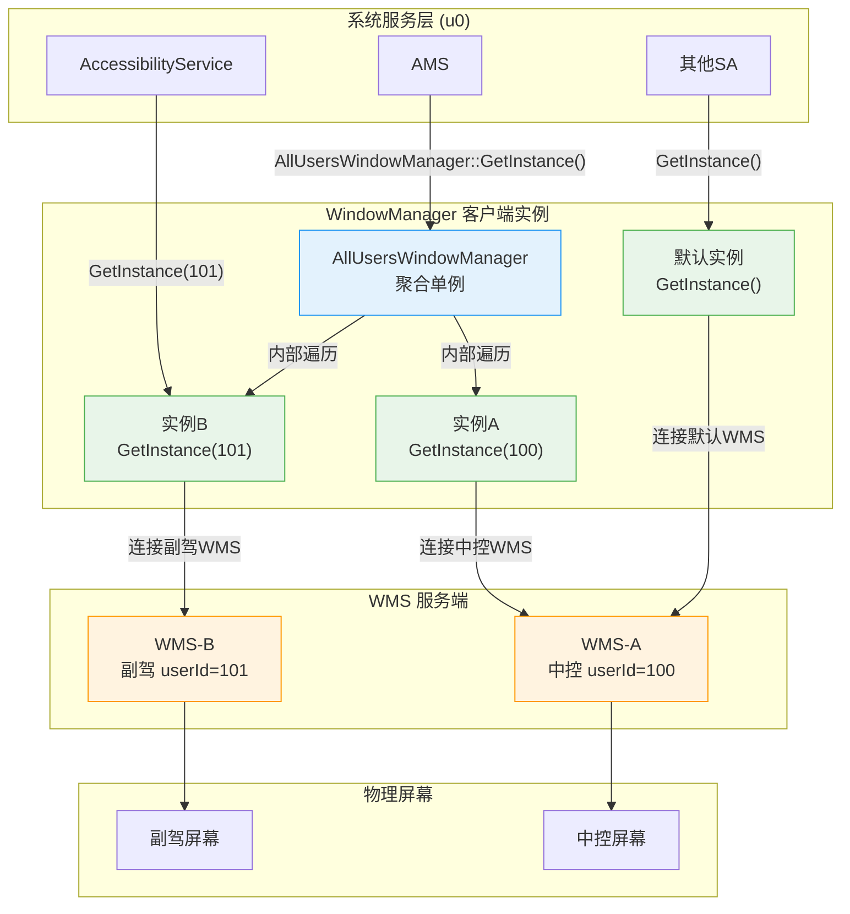
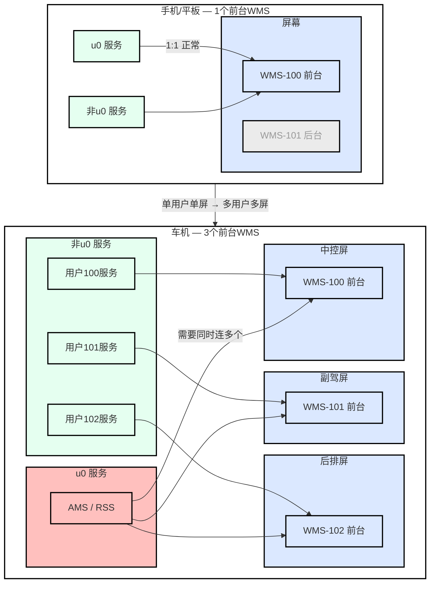

# 车机多屏多用户 WindowManager开发指南

## 1. 背景

OpenHarmony传统架构基于**单前台用户**假设：系统同一时刻只有一个活跃用户，WindowManager采用单例模式，所有系统服务通过 `WindowManager::GetInstance()` 获取唯一实例，连接唯一的WMS服务端。这种设计适用于手机、平板等个人设备。

车机场景存在特殊性：**中控与副驾同时存在前台用户**（如userId=100和userId=101），各自有独立的WMS服务端实例。如果系统SA（运行在u0）继续使用传统单例模式，将无法与副驾WMS交互，导致：

- 无障碍服务无法获取副驾用户的窗口信息，只能获取中控数据
- 输入法服务无法管理副驾用户的输入法窗口

因此，运行在u0的系统SA需要根据业务需求选择合适的开发范式进行适配。

---

## 2. 概述

车机场景下中控与副驾同时存在前台用户，OpenHarmony WindowManager 提供三种开发范式：

| 维度 | 单用户模式 | 指定实例模式 | 聚合模式 |
|-----|-----------|------------|---------|
| API | `WindowManager::GetInstance()` | `WindowManager::GetInstance(userId)` | `AllUsersWindowManager::GetInstance()` |
| 数据范围 | 单个用户 | 单个指定用户 | 所有活跃用户 |
| 监听注册 | 单次注册 | 需为每个用户单独注册 | 一次注册覆盖所有用户 |
| 适用场景 | 单用户设备/普通应用 | 操作指定用户窗口 | 获取所有用户窗口信息 |

### 2.1 架构与连接关系



- **单用户模式**：`GetInstance()` → 默认实例 → 连接默认WMS（中控）
- **指定实例模式**：`GetInstance(userId)` → 对应userId的实例 → 连接该用户的WMS
- **聚合模式**：`AllUsersWindowManager` → 内部遍历所有活跃用户的实例 → 遍历所有WMS

### 2.1.1 背景差异 — 手机 vs 车机



- **手机/平板**：1个前台WMS，u0服务与非u0服务均为1:1连接，无适配问题
- **车机**：3个前台WMS（中控/副驾/后排），非u0服务仍为1:1连接不受影响，但u0服务（AMS/RSS等）需要同时连接多个WMS，当前单例模式无法满足
- **配色含义**：蓝色(#DBE8FF)=屏幕/WMS前台，粉色(#FFC0BE)=u0服务(问题所在)，绿色(#E5FFF0)=非u0服务(正常)，灰色(#EBEBEB)=WMS后台

### 2.2 快速开始

```cpp
// 单用户模式 - 最常用，无需任何改动
WindowManager::GetInstance().GetFocusWindowInfo(info, displayId);

// 指定实例模式 - 操作特定用户窗口
WindowManager::GetInstance(userId).GetFocusWindowInfo(info, displayId);

// 聚合模式 - 获取所有用户窗口信息
AllUsersWindowManager::GetInstance().GetAllMainWindowInfo(allMainWindows);
```

---

## 3. 单用户模式

### 3.1 适用场景

- 单用户设备（手机、平板）
- 仅操作本用户窗口的系统SA
- 普通应用

### 3.2 API

| 接口 | 返回类型 | 说明 |
|-----|---------|------|
| `GetInstance()` | `WindowManager&` | 获取默认实例 |

### 3.3 使用示例

```cpp
WindowManager::GetInstance().GetFocusWindowInfo(info, displayId);
WindowManager::GetInstance().RegisterFocusChangedListener(listener);
```

### 3.4 注意事项

- 默认实例行为：非u0用户连接当前用户WMS；u0用户连接默认WMS
- 单用户模式下无需关心userId
- 当多实例未启用时，聚合模式自动降级为单用户模式

---

## 4. 指定实例模式

### 4.1 适用场景

运行在系统用户(u0)且需要与指定用户WMS交互的系统SA：

- 无障碍服务：获取指定屏幕用户的窗口信息
- 输入法服务：根据用户操作屏幕管理输入法窗口

### 4.2 API

| 类 | 接口 | 返回类型 | 说明 |
|---|---|---|---|
| WindowManager | `GetInstance(int32_t userId)` | `WindowManager&` | 获取指定用户的实例 |
| WindowManager | `RemoveInstanceByUserId(int32_t userId)` | `WMError` | 移除指定用户实例 |
| WindowManagerLite | `GetInstance(int32_t userId)` | `WindowManagerLite&` | 获取指定用户的Lite实例 |
| WindowManagerLite | `RemoveInstanceByUserId(int32_t userId)` | `WMError` | 移除指定用户Lite实例 |

### 4.3 使用示例

```cpp
// 获取副驾用户(userId=101)的焦点窗口信息
WindowManager::GetInstance(101).GetFocusWindowInfo(info, displayId);

// 用户退出时清理实例
void OnUserRemoved(int32_t userId) {
    WindowManager::RemoveInstanceByUserId(userId);
    WindowManagerLite::RemoveInstanceByUserId(userId);
}
```

### 4.4 注意事项

#### userId获取方式

| 来源 | 方式 |
|-----|------|
| AccountManager | `AccountManager::GetActiveUserIds()` 获取活跃用户列表 |
| 屏幕位置映射 | 根据屏幕ID或位置映射（中控→100，副驾→101） |
| 窗口回调参数 | `info->uid_ / 200000` |
| 业务场景 | 根据请求来源确定（如截屏API传入的屏幕参数） |

---

## 5. 聚合模式

### 5.1 适用场景

运行在系统用户(u0)且需要同时获取所有用户窗口信息的系统SA：

- AMS：注册所有前台用户空间的焦点变化监听

### 5.2 API

| 接口 | 返回类型 | 说明 |
|-----|---------|------|
| `GetInstance()` | `AllUsersWindowManager&` | 获取聚合实例（单例） |
| `GetActiveUserIds()` | `unordered_set<int32_t>` | 获取所有活跃用户ID |
| `GetVisibilityWindowInfo(infos)` | `WMError` | 聚合所有用户可见窗口信息 |
| `GetAccessibilityWindowInfo(infos)` | `WMError` | 聚合所有用户无障碍窗口信息 |
| `GetAllMainWindowInfo(infos)` | `WMError` | 聚合所有用户主窗口信息 |
| `RegisterFocusChangedListener(listener)` | `WMError` | 注册全局焦点监听 |
| `UnregisterFocusChangedListener(listener)` | `WMError` | 注销全局焦点监听 |
| `RegisterVisibilityChangedListener(listener)` | `WMError` | 注册全局可见性监听 |
| `UnregisterVisibilityChangedListener(listener)` | `WMError` | 注销全局可见性监听 |

### 5.3 使用示例

```cpp
// 获取所有用户主窗口
std::vector<sptr<MainWindowInfo>> allMainWindows;
AllUsersWindowManager::GetInstance().GetAllMainWindowInfo(allMainWindows);

// 注册全局焦点监听
AllUsersWindowManager::GetInstance().RegisterFocusChangedListener(listener);

// 回调中获取userId
class MyFocusListener : public IFocusChangedListener {
public:
    void OnFocused(const sptr<FocusChangeInfo>& info) override
    {
        int32_t userId = info->uid_ / 200000;
        HandleFocusChange(info, userId);
    }
    void OnUnfocused(const sptr<FocusChangeInfo>& info) override {}
};
```

### 5.4 注意事项

#### 动态用户管理

`AllUsersWindowManager` 自动处理用户增减，SA无需手动干预：
- 用户激活时：自动为新用户注册已注册的全局监听器
- 用户退出时：自动清理相关实例


#### 线程安全

同一个listener可能被多个Binder线程并发回调（来自不同用户的WMS），需在回调方法中自行保护线程安全。

#### 单实例降级

当多实例模式未启用时，目前只在车机上启用，聚合接口自动降级为 `WindowManager::GetInstance()` 调用，适用于单用户设备。

---

## 6. 通用注意事项

只有运行在u0的系统用户才启用多实例。普通应用和非u0进程自动使用单用户模式。

---

## 6.1 遗留问题

### Bug 5: `OnUserRemoved` 不注销全局监听器

**文件**: `wm/src/all_users_window_manager.cpp:256`

**问题**: `OnUserRemoved` 只调用 `WindowManager::RemoveInstanceByUserId(userId)` 移除本地实例，没有先从该实例上注销全局监听器（focus/visibility）。服务端 agent 残留，可能产生幽灵回调。

**影响**: 用户退出后，服务端仍持有该用户的 WindowManagerAgent 引用，如果对应 sceneboard 仍在运行，可能向已销毁的客户端实例推送事件。

**修复方案**:
```cpp
void AllUsersWindowManager::OnUserRemoved(int32_t userId)
{
    // 先注销全局监听器（会触发 IPC 向服务端移除 agent）
    auto wm = WindowManager::GetInstance(userId);
    for (const auto& listener : globalFocusListeners_) {
        wm.UnregisterFocusChangedListener(listener);
    }
    for (const auto& listener : globalVisibilityListeners_) {
        wm.UnregisterVisibilityChangedListener(listener);
    }
    // 再移除实例
    WindowManager::RemoveInstanceByUserId(userId);
}
```

**状态**: 待修复（需注意线程安全和 `globalListenersMutex_` 加锁）

---

## 7. 常见问题 FAQ

### Q1: 普通应用需要适配吗？

不需要。普通应用运行在非u0用户空间，调用 `GetInstance()` 自动使用当前用户实例。

### Q2: 实例何时需要清理？

用户退出系统时调用：
```cpp
WindowManager::RemoveInstanceByUserId(userId);
WindowManagerLite::RemoveInstanceByUserId(userId);
```

### Q3: 默认GetInstance()行为？

```cpp
WindowManager::GetInstance();    // 返回默认实例
WindowManager::GetInstance(-1);  // 同样返回默认实例
// 非u0用户：连接当前用户WMS
// u0用户：连接默认WMS
```

---

## 8. 参考资料

- 头文件: `interfaces/innerkits/wm/window_manager.h`

对比

```
@startuml WorkloadComparison
title 多实例模式 vs 聚合模式 — SA适配工作量对比
left to right direction
package "多实例模式\nSA手动指定userId" as PlanA {
  rectangle "SA 适配工作" as SA_Work_A #FFE0B2 {
    rectangle "1. 获取活跃用户列表" as A1 #FFCDD2
    rectangle "2. 逐用户注册监听" as A2 #FFCDD2
    rectangle "3. 逐用户查询拼接数据" as A3 #FFCDD2
    rectangle "4. 用户切换时增删监听" as A4 #FFCDD2
    rectangle "5. 进程死亡后重新注册" as A5 #FFCDD2
  }
  rectangle "窗口客户端" as WM_A #C8E6C9 {
    rectangle "提供GetInstance(userId)" as WA1
  }
}
package "聚合模式\n窗口屏蔽复杂性" as PlanB {
  rectangle "SA 适配工作" as SA_Work_B #FFE0B2 {
    rectangle "1. 注册监听\n一行代码" as B1 #E8F5E9
    rectangle "2. 查询数据\n一行代码，自动聚合" as B2 #E8F5E9
    rectangle "3. 用户切换/进程死亡\n无需关心，全自动" as B3 #E8F5E9
  }
  rectangle "窗口自动屏蔽的工作\n原SA工作，现由窗口自动完成" as WM_B #C8E6C9 {
    rectangle "1. 维护活跃用户列表" as WB1 #B3E5FC
    rectangle "2. 自动注册/注销监听" as WB2 #B3E5FC
    rectangle "3. 自动查询并聚合数据" as WB3 #B3E5FC
    rectangle "4. 用户切换自动跟随" as WB4 #B3E5FC
    rectangle "5. 进程死亡自动恢复" as WB5 #B3E5FC
  }
}
A1 -- A2
A2 -- A3
A3 -- A4
A4 -- A5
B1 -- B2
B2 -- B3
WB1 -- WB2
WB2 -- WB3
WB3 -- WB4
WB4 -- WB5
@enduml
```