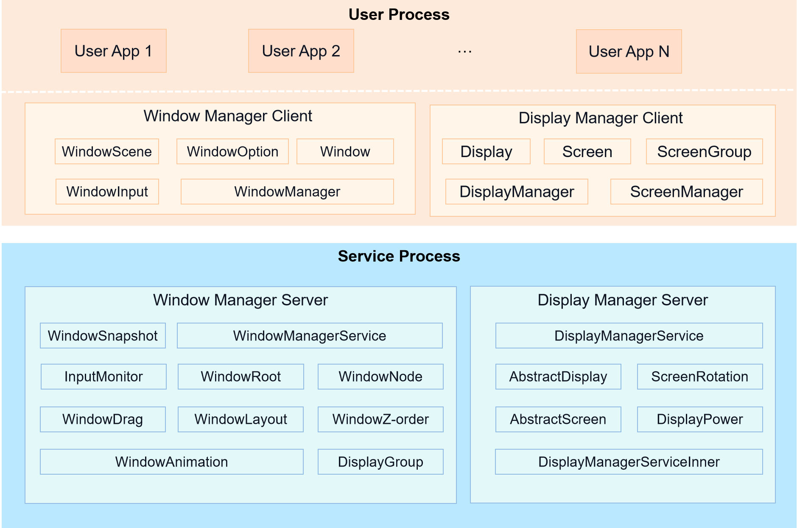
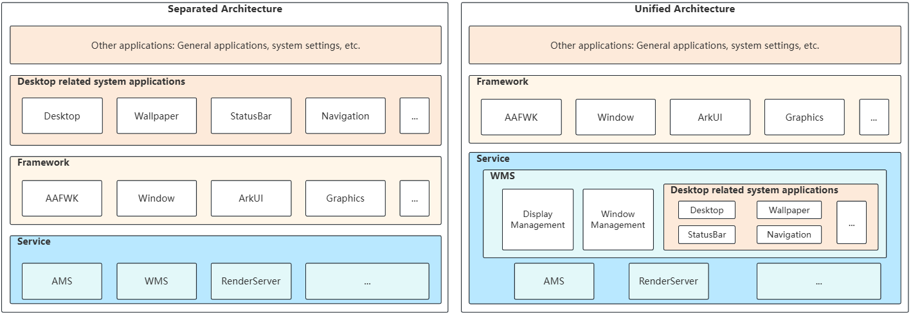
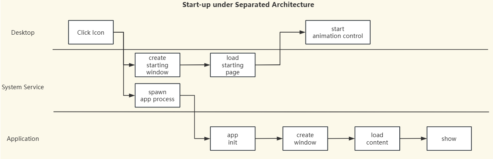
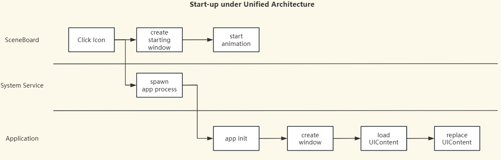

# Window Manager

## Introduction

The Window Manager subsystem provides basic capabilities of window and display management. It is the basis for UI display. The following figure shows the architecture of the Window Manager subsystem.

**Figure 1** Architecture of the Window Manager subsystem



- **Window Manager Client**

    Provides window object abstraction and window management interfaces, and connects to the ability and UI framework.

- **Display Manager Client**

    Provides display information abstraction and display management interfaces.

- **Window Manager Server**

    Provides capabilities such as window layout, Z-order control, window tree structure, window dragging, and window snapshot, and offers the window layout and focus window for multimodal input.

- **Display Manager Server**

    Provides display information, screenshot, screen on/off, and brightness processing control, and processes the mapping between the display and screen.

## Architectures
The current `window_manager` part, incorporates two architectures of the window subsystem. Respectively referred to as the "separated architecture" and the "unified architecture". 

The main differences are shown in the **Figure 2**:  

- **Separated Architecture**
The "desktop-related" system Apps, such as the desktop and wallpaper, are all located in the application layer and operate independently in separate processes.Therefore, under this architecture, the APPs task management, such as the startup and shutdown of applications, involve multiple IPC communication between desktop-related system APPs and system services, as well as between system services and APPs. 

- **Unified Architecture**
The desktop-related system Apps and the window management service process are integrated together. They no longer run as independent processes but have transformed into individual system "[WindowScene Component](https://gitcode.com/openharmony/arkui_ace_engine/blob/master/frameworks/core/components_ng/pattern/window_scene/scene)". Therefore, the window management subsystem provides new "WindowScene Component" for implementing the management of windows and the layout management of windows.
In addition, screen management are also provided by the "[Screen Component](https://gitcode.com/openharmony/arkui_ace_engine/blob/master/frameworks/core/components_ng/pattern/window_scene/screen)".

### Key Differences in Different Architectures
On one hand, the management of windows has shifted to being accomplished through window controls. On the other hand, system applications related to the desktop have transformed into system window controls. As a result, there have been significant changes in the task management processes such as startup and shutdown.

- **Separated Architecture**


- **Unified Architecture**


## Directory Structure

```
foundation/window/window_manager/
├── dm                              # Dislplay Manager Client   
├── dmserver                        # Dislplay Manager Service  
├── extension                       # Ability Component Window  
│   ├── extension_connection        # Ability Component  
│   └── window_extension            # Ability Component 被嵌入部分
├── interfaces                      # apis
│   ├── innerkits                   # native apis   
│   └── kits                        # js/napi apis  
├── previewer                       # lite previewer for IDE   
├── resources                       # resources   
├── sa_profile                      # system ability configs
├── snapshot                        # snapshow util 
├── test                            # tests like fuzz 
├── utils                           # utils functions
├── window_scene                    # Unified Window Manager Service
├── wm                              # Window Manager Client 
└── wmserver                        # Separated Window Manager Service  
```

## Constraints

- Programming language version
  - C++ 11 or later

## Available APIs

- [Window](https://gitee.com/openharmony/docs/blob/master/en/application-dev/reference/apis/js-apis-window.md)
- [Display](https://gitee.com/openharmony/docs/blob/master/en/application-dev/reference/apis/js-apis-display.md)

## Repositories Involved

- [graphic_graphic_2d](https://gitee.com/openharmony/graphic_graphic_2d)
- [arkui_ace_engine](https://gitee.com/openharmony/arkui_ace_engine)
- [ability_ability_runtime](https://gitee.com/openharmony/ability_ability_runtime)
- [multimodalinput_input](https://gitee.com/openharmony/multimodalinput_input)
