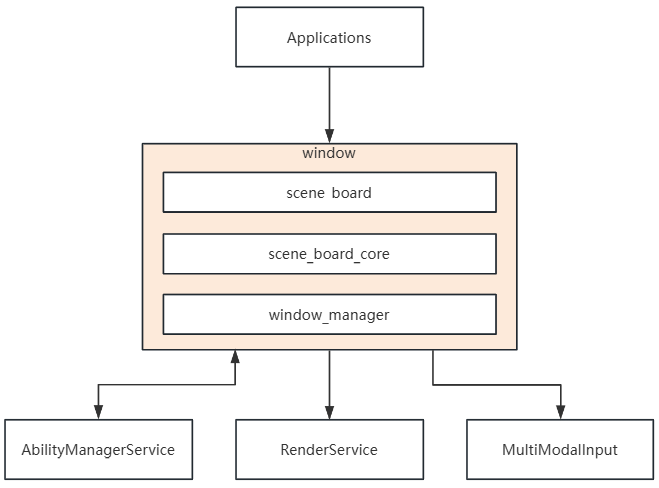
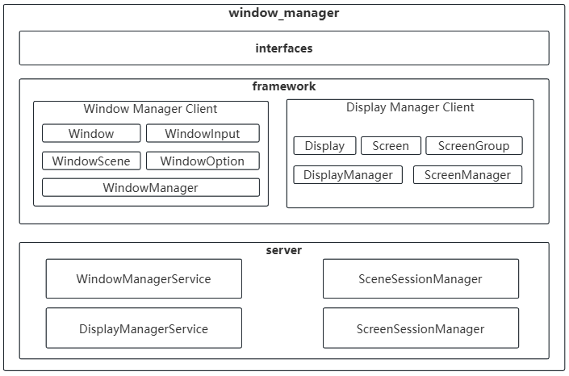
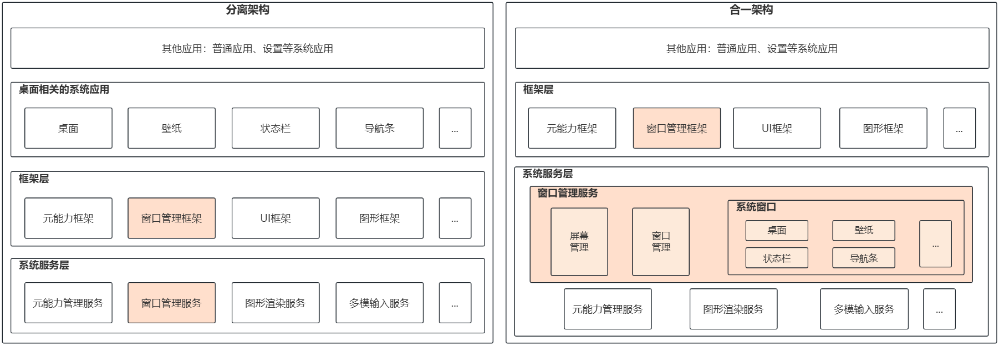
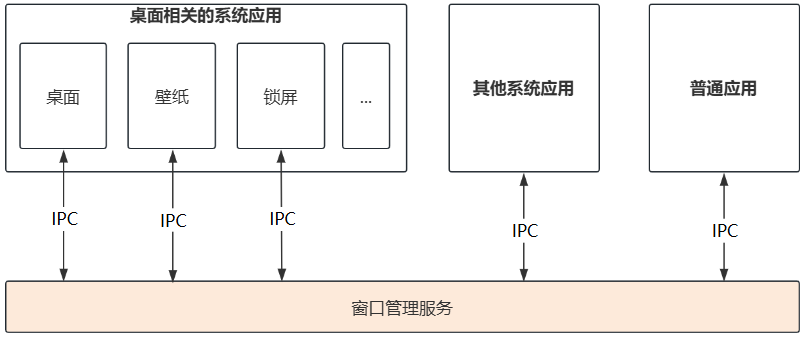
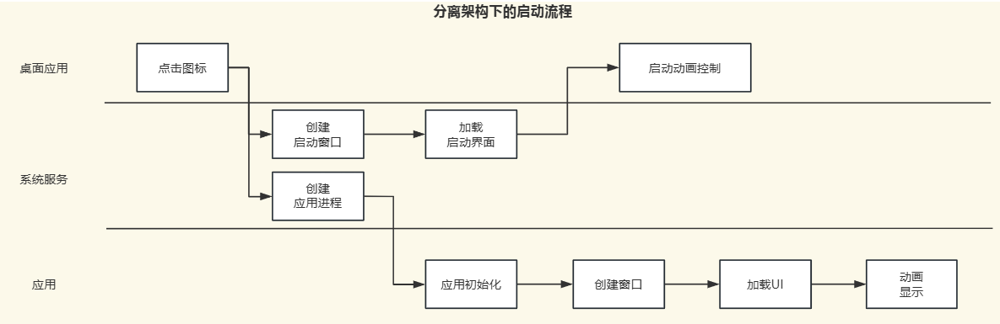
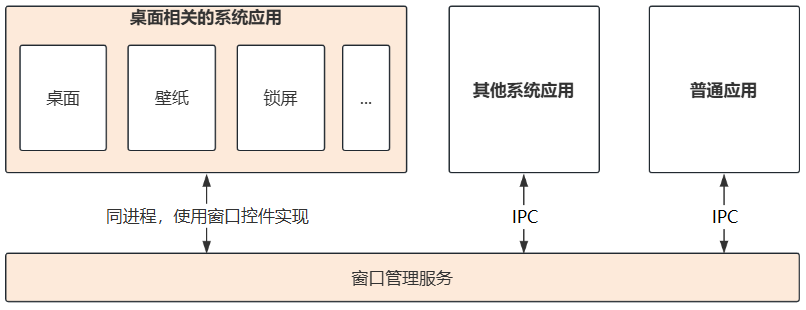
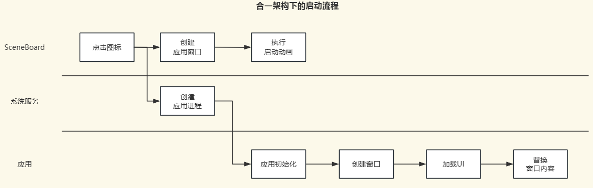

# window_manager

-   [简介](#1-简介)
-   [架构说明](#2-架构说明)
-   [分离架构与合一架构详解](#3-分离架构与合一架构详解)
-   [各子模块架构详解](#4-各子模块架构详解)
-   [开发方式](#5-开发方式)
-   [目录](#6-目录)
-   [约束](#7-约束)
-   [接口说明](#8-接口说明)
-   [相关仓](#9-相关仓)

## 1. 简介

### 1.1 窗口子系统概述
窗口管理子系统为 OpenHarmony 系统提供窗口管理和显示管理的核心能力，是UI显示的基础子系统，负责协调和管理系统中所有窗口的创建、销毁、布局、显示和交互。

### 1.2 核心能力
#### 屏幕管理能力
- **Display-Screen映射**：逻辑Display与物理Screen的映射关系管理
- **Display管理**：多Display管理、信息查询
- **屏幕控制**：屏幕亮灭控制、亮度调节
- **屏幕截图**：全屏截图功能

#### 窗口管理能力
- **窗口生命周期管理**：窗口的创建、显示、隐藏、销毁
- **窗口关系与结构**：父子窗口关系管理，支持窗口嵌套
- **窗口布局管理**：窗口的位置、大小、层级控制
- **窗口交互能力**：窗口拖拽、缩放、移动等交互操作
- **窗口快照**：窗口内容截图能力
- **焦点管理**：窗口焦点切换和输入事件分发
- **多模态输入支持**：为多模态输入系统提供窗口布局和焦点窗口信息

### 1.3 部件与关系


窗口子系统共有3个部件，分别是：
1. `window_manager`:  当前部件，承载了窗口管理服务与应用层窗口框架。
	1. 是整个窗口子系统的核心底座。
2. `scene_board_core`: 承载了桌面相关系统应用和系统UI与窗口管理服务的中间层框架。
	1. 是 `window_manager` 与 `scene_board` 的中间层。
3. `scene_board`: 承载了桌面相关系统应用和系统UI实现，例如桌面、壁纸、锁屏、状态栏、导航条、控制中心等。
	1. 是窗口子系统的最上层模块，是用户与系统UI的入口。

窗口子系统主要与这些子系统关联，分别是：
- **应用**：应用可通过 window 或 display 相关API管理窗口和屏幕
- **多模输入子系统**：多模输入系统依赖窗口子系统进行事件分发
- **图形渲染子系统**：窗口需要与图形渲染系统协同工作，完成窗口管理和UI渲染。

此外，窗口子系统还为以下对象服务：
- **系统应用**：为桌面、壁纸等系统级UI应用提供系统窗口和应用窗口管理的能力。
- **UI框架**：`ArkUI` 框架通过窗口实现UI渲染。

## 2. 架构说明

### 2.1 整体架构

窗口子系统采用 `Client-Server` 架构，通过IPC（进程间通信）实现客户端和服务端的分离。
整体架构图如下：



### 2.2 架构设计原理
分层设计：
- **接口层**：
	- 提供 Native API 和 JS/NAPI 接口，供应用调用
- **客户端层**：
	- Window Manager Client 和 Display Manager Client，负责接口层的封装、应用框架实现和 IPC 通信
- **服务端层**：
	- WindowManagerService 和 DisplayManagerService，作为系统服务（ServiceAbility）负责提供窗口管理和屏幕管理的核心业务逻辑
    - SceneSessionManager 和 ScreenSessionManager，是系统服务层的窗口管理和屏幕管理的核心业务实现模块

分层设计下的协同关系：
- **应用创建窗口流程**
    ```
    应用 → window API → Window Manager Client → IPC → WindowManagerService
    ```

- **显示信息查询流程**
    ```
    应用 → display API → Display Manager Client → IPC → DisplayManagerService
    ```

### 2.3 双架构
窗口子系统当前共有两个基础架构，分别是分离架构和合一架构。可通过编译时特性配置进行切换。
- **全局特性配置项**：`window_manager_use_sceneboard`
- **配置文件**：`product/define.gni` 或系统特性配置文件
- **配置方式**：
    ```gni
    # 选择分离架构
    window_manager_use_sceneboard = false

    # 选择合一架构
    window_manager_use_sceneboard = true
    ```
- **影响范围**：
	- 分离架构：编译 `window_manager/wmserver` 模块
	- 合一架构：编译 `window_manager/window_scene` 模块、`scene_board_core` 和 `scene_board`

#### 架构差异


两种架构对外提供完全相同的API接口，应用层无感知，差异主要体现在内部实现和进程模型上。

## 3. 分离架构与合一架构详解

### 3.1 分离架构

#### 3.1.1 架构特点

分离架构是传统的窗口管理实现方式，具有以下特点：
- **独立进程模型**：桌面、壁纸等系统应用作为独立进程运行
- **传统IPC通信**：应用启动/退出涉及多次IPC通信

#### 3.1.2 进程模型


#### 3.1.3 启动流程



**应用启动步骤**：
1. 点击图标，启动应用。
2. 经过IPC，由其他系统服务创建进程、由窗口先创建启动窗口并加载启动界面。
3. 经过多次IPC，应用和系统服务建连并调度不同的生命周期（例如: `onCreate`，`onForeground`）。
4. 应用在启动过程中创建应用窗口，并加载应用UI界面。
5. 过程中由桌面以IPC的方式，利用窗口管理服务实现控制应用窗口的启动动画。

#### 3.1.4 优缺点

**优点**：
- 进程隔离性好，系统应用崩溃不影响窗口服务
- 架构清晰，职责分离明确
- 适合传统桌面系统

**缺点**：
- IPC通信开销大
- 启动流程复杂，涉及多次IPC
- 跨进程窗口管理复杂

### 3.2 合一架构

#### 3.2.1 架构特点

合一架构是新的窗口管理实现方式，具有以下特点：
- **进程合一**：桌面、壁纸等系统应用与窗口服务合并在同一进程
- **控件化管理**：系统应用转变为系统窗口控件
- **布局驱动**：通过ArkUI的布局管线驱动窗口布局管理

#### 3.2.2 进程模型


#### 3.2.3 启动流程



**启动步骤**：
1. 点击图标，启动应用。
2. 由窗口管理服务先创建窗口，并加载启动界面。
3. 由窗口管理服务通知元能力管理服务，启动应用并调度不同的生命周期（例如: `onCreate`，`onForeground`）。
4. 应用启动后，加载UI界面，并与窗口管理服务建连，替换UI界面。
5. 过程中桌面和窗口管理服务同进程，直接控制应用窗口的启动动画。

#### 3.2.4 核心组件

**WindowScene组件**：
- 负责窗口的控件化管理
- 实现窗口控件的布局管理
- 提供窗口生命周期控制

**Screen组件**：
- 负责屏幕的控件化管理
- 管理物理屏幕和逻辑Display的映射
- 提供屏幕控制能力

#### 3.2.5 优缺点

**优点**：
- 减少IPC通信，性能更好
- 启动流程简化，启动速度快
- 利用ArkUI布局管线，布局管理更灵活
- 适合移动和嵌入式系统

**缺点**：
- 进程耦合度高
- 系统应用崩溃可能影响窗口服务
- 调试复杂度增加

## 4. 各子模块架构详解

### 4.1 Window Manager Client（wm）

#### 4.1.2 模块职责

1. **窗口对象抽象**：提供Window类，封装窗口的所有操作
2. **接口封装**：将底层IPC通信封装为易用的API
3. **生命周期管理**：管理窗口对象的创建和销毁
4. **事件回调**：处理窗口状态变化事件
5. **IPC通信**：与服务端进行IPC通信

#### 4.1.3 协同关系

```
应用代码
   ↓
Window API (interfaces/kits)
   ↓
Window Manager Client (wm)
   ↓
IPC通信
   ↓
Window Manager Server
```

### 4.2 Display Manager Client（dm）

#### 4.2.1 模块组成

```
dm/
├── include/                # 头文件
│   ├── display.h           # Display接口定义
│   └── display_info.h      # Display信息结构
└── src/                    # 实现文件
    ├── display.cpp         # Display实现
    └── display_manager.cpp # Display管理器
```

#### 4.2.2 模块职责

1. **Display信息抽象**：提供Display类，封装Display信息查询
2. **接口封装**：提供Display管理API
3. **IPC通信**：与Display Manager Server通信
4. **事件监听**：监听Display变化事件

#### 4.2.3 协同关系

```
应用代码
   ↓
Display API (interfaces/kits)
   ↓
Display Manager Client (dm)
   ↓
IPC通信
   ↓
Display Manager Server
```

### 4.3 Window Manager Server（wmserver）

#### 4.3.1 模块组成

```
wmserver/
├── include/              # 头文件
│   ├── window_root.h     # 窗口根节点
│   ├── window_node.h     # 窗口节点
│   ├── window_layout.h   # 窗口布局管理
│   └── ...
└── src/                 # 实现文件
    ├── window_root.cpp   # 窗口根节点实现
    ├── window_node.cpp   # 窗口节点实现
    ├── window_layout.cpp # 窗口布局实现
    └── ...
```

#### 4.3.2 模块职责

1. **窗口树管理**：维护窗口树结构，管理父子窗口关系
2. **窗口布局**：计算窗口位置、大小，处理窗口布局
3. **Z序管理**：管理窗口层级，控制窗口显示顺序
4. **焦点管理**：管理窗口焦点，处理焦点切换
5. **输入分发**：为输入系统提供焦点窗口信息
6. **窗口拖拽**：处理窗口拖拽逻辑
7. **窗口快照**：提供窗口截图能力

#### 4.3.3 核心类说明

- **WindowRoot**：窗口树的根节点，管理所有顶层窗口
- **WindowNode**：窗口节点，表示一个窗口实例
- **WindowLayout**：窗口布局管理器，负责窗口布局计算
- **FocusController**：焦点控制器，管理窗口焦点

#### 4.3.4 协同关系

```
IPC通信
   ↓
Window Manager Service
   ├── WindowRoot (窗口树)
   ├── WindowLayout (布局管理)
   ├── FocusController (焦点管理)
   └── ...
   ↓
图形系统 (RenderService)
```

### 4.4 Display Manager Server（dmserver）

#### 4.4.1 模块组成

```
dmserver/
├── include/              # 头文件
│   ├── abstract_display.h       # 抽象Display
│   ├── abstract_screen.h         # 抽象Screen
│   ├── display_controller.h      # Display控制器
│   └── ...
└── src/                 # 实现文件
    ├── abstract_display.cpp     # 抽象Display实现
    ├── abstract_screen.cpp       # 抽象Screen实现
    └── ...
```

#### 4.4.2 模块职责

1. **Display管理**：管理逻辑Display，提供Display信息查询
2. **Screen管理**：管理物理Screen，提供Screen控制
3. **映射管理**：维护Display与Screen的映射关系
4. **屏幕控制**：控制屏幕亮灭、亮度等
5. **屏幕截图**：提供全屏截图功能

#### 4.4.3 核心类说明

- **AbstractDisplay**：抽象Display类，表示逻辑显示器
- **AbstractScreen**：抽象Screen类，表示物理屏幕
- **DisplayController**：Display控制器，管理Display生命周期

#### 4.4.4 协同关系

```
IPC通信
   ↓
Display Manager Service
   ├── AbstractDisplay (逻辑Display)
   ├── AbstractScreen (物理Screen)
   └── DisplayController (控制器)
   ↓
硬件抽象层 (HDI)
```

### 4.5 WindowScene（window_scene）

#### 4.5.1 模块组成

```
window_scene/
├── include/              # 头文件
│   ├── scene_root.h      # 场景根节点
│   ├── scene_board.h     # 场景面板
│   └── ...
└── src/                 # 实现文件
    ├── scene_root.cpp    # 场景根节点实现
    └── scene_board.cpp   # 场景面板实现
```

#### 4.5.2 模块职责

1. **场景管理**：管理窗口场景，作为窗口控件的容器
2. **控件化管理**：将窗口作为 `ArkUI` 控件进行管理
3. **布局集成**：集成 `ArkUI` 布局管线，实现布局管线复用
4. **系统控件管理**：管理桌面、壁纸等系统窗口控件

#### 4.5.4 协同关系

```
IPC通信
   ↓
WindowScene (ArkUI Component)
   ├── RootScene (场景根)
   ├── SystemWindowScene - 桌面控件
   ├── SystemWindowScene - 壁纸控件
   └── WindowScene - 应用窗口控件
   ↓
ArkUI布局管线
   ↓
图形渲染系统
```

### 4.6 Extension（extension）

#### 4.6.1 模块组成

```
extension/
├── extension_connection/  # ExtensionAbility组件连接部分
│   ├── ability_connection.cpp
│   └── ...
└── window_extension/      # ExtensionAbility组件窗口部分
    ├── window_extension.cpp
    └── ...
```

#### 4.6.2 模块职责

1. **Ability绑定**：实现Ability与窗口的绑定关系
2. **生命周期同步**：同步Ability和窗口的生命周期
3. **属性传递**：在Ability和窗口之间传递属性

#### 4.6.3 协同关系

```
Ability框架
   ↓
Extension
   ├── ExtensionConnection (连接管理)
   └── WindowExtension (窗口扩展)
   ↓
Window Manager
```

## 5. 开发方式

### 5.1 窗口属性

**可定制窗口属性**：
```cpp
// 窗口类型
enum class WindowType {
    TYPE_APP,              // 应用窗口
    TYPE_SYSTEM_ALERT,     // 系统提示窗口
    TYPE_INPUT_METHOD,     // 输入法窗口
    TYPE_STATUS_BAR,        // 状态栏窗口
    TYPE_PANEL,            // 面板窗口
    TYPE_FLOAT,            // 浮动窗口
    // ... 可根据需求扩展
};

// 窗口模式
enum class WindowMode {
    UNDEFINED,
    FULLSCREEN,            // 全屏模式
    PRIMARY,              // 分屏主窗口
    SECONDARY,            // 分屏副窗口
    FLOATING,             // 浮动模式
};

// 窗口布局属性
struct WindowLayoutProperty {
    Rect rect;            // 窗口位置和大小
    uint32_t zOrder;      // 窗口层级
    WindowMode mode;      // 窗口模式
    // ... 可根据需求扩展
};
```

**开发方式**：
1. 扩展 `WindowType` 枚举，添加自定义窗口类型
2. 在Window Manager Server中添加对应的窗口类型处理逻辑
3. 修改窗口布局算法，支持新的窗口类型

#### 添加自定义类型

**步骤1**：扩展窗口类型枚举
```cpp
// 在 interfaces/innerkits/native/include/window/window_type.h 中
enum class WindowType {
    // ... 原有类型
    TYPE_CUSTOM_WINDOW = 1000,  // 自定义窗口类型
};
```

**步骤2**：添加窗口类型处理逻辑
```cpp
// 在 wmserver/src/window_type.cpp 中
bool IsSystemWindow(WindowType type)
{
    // ... 原有逻辑
    if (type == WindowType::TYPE_CUSTOM_WINDOW) {
        return true;
    }
    return false;
}
```

**步骤3**：在布局算法中处理新类型
```cpp
// 在 wmserver/src/window_layout.cpp 中
void WindowLayout::CalculateLayout(WindowNode* node)
{
    if (node->GetType() == WindowType::TYPE_CUSTOM_WINDOW) {
        // 自定义布局逻辑
        CalculateCustomWindowLayout(node);
    } else {
        // 默认布局逻辑
        CalculateDefaultLayout(node);
    }
}
```


### 5.2 窗口布局算法

**可定制布局算法**：
```cpp
// 在 window_layout.h 中
class WindowLayout {
public:
    // 可重写的布局计算函数
    virtual void CalculateLayout(WindowNode* node);
    virtual void CalculateZOrder(std::vector<WindowNode*>& nodes);

protected:
    // 布局策略
    LayoutStrategy layoutStrategy_;

    // 定制：添加自定义布局策略
    void ApplyCustomLayout(WindowNode* node);
};
```

**定制步骤**：
1. 继承 `WindowLayout` 类
2. 重写 `CalculateLayout` 方法，实现自定义布局算法
3. 在Window Manager Server中使用自定义布局类

### 5.3 注意事项

1. **兼容性**：需要保持与原有接口的兼容性
2. **性能**：业务逻辑不能影响系统性能
3. **稳定性**：代码需要充分测试，确保不影响系统稳定性
4. **可维护性**：代码需要良好的注释和文档
5. **版本升级**：系统升级时需要考虑兼容性

## 目录
```
foundation/window/window_manager/
├── dm                              # Dislplay Manager Client实现代码    
├── dmserver                        # Dislplay Manager Service实现代码  
├── extension                       # Ability Component 窗口相关代码实现目录  
│   ├── extension_connection        # Ability Component 嵌入部分 
│   └── window_extension            # Ability Component 被嵌入部分
├── interfaces                      # 对外接口存放目录   
│   ├── innerkits                   # native接口存放目录   
│   └── kits                        # js/napi接口存放目录  
├── previewer                       # IDE轻量模拟器窗口代码实现目录   
├── resources                       # 框架使用资源文件存放目录   
├── sa_profile                      # 系统服务配置文件
├── snapshot                        # 截屏命令行工具实现代码 
├── test                            # Fuzz测试和系统测试用例存放目录 
├── utils                           # 工具类存放目录  
├── window_scene                    # 合一架构 Window Manager Service实现代码 
├── wm                              # Window Manager Client实现代码  
└── wmserver                        # 分离架构 Window Manager Service实现代码  
```

## 约束
- 语言版本
    - C++11或以上

## 接口说明

- [Window](https://gitcode.com/openharmony/docs/blob/master/zh-cn/application-dev/reference/apis-arkui/arkts-apis-window.md)
- [Display](https://gitcode.com/openharmony/docs/blob/master/zh-cn/application-dev/reference/apis-arkui/js-apis-display.md)

## 相关仓
- [graphic_graphic_2d](https://gitcode.com/openharmony/graphic_graphic_2d)
- [arkui_ace_engine](https://gitcode.com/openharmony/arkui_ace_engine)
- [ability_ability_runtime](https://gitcode.com/openharmony/ability_ability_runtime)
- [multimodalinput_input](https://gitcode.com/openharmony/multimodalinput_input)